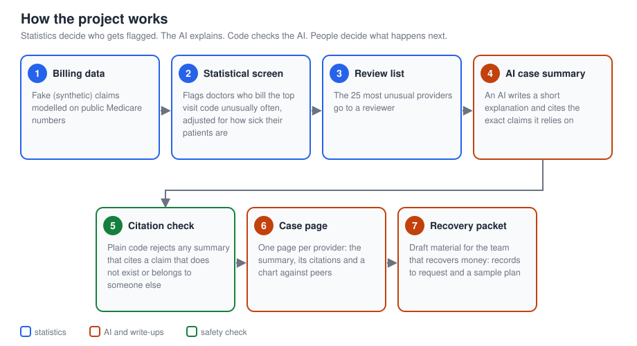
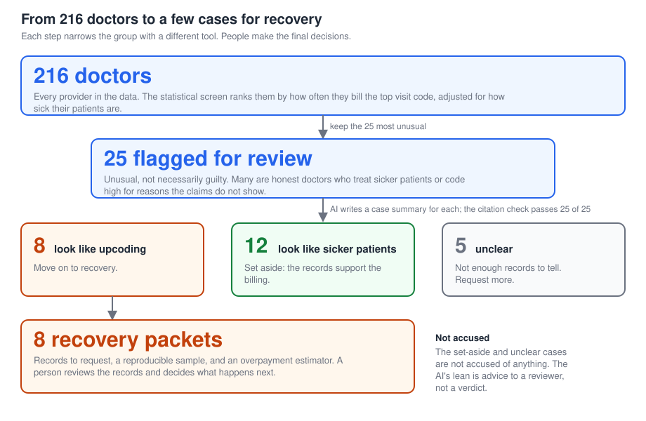
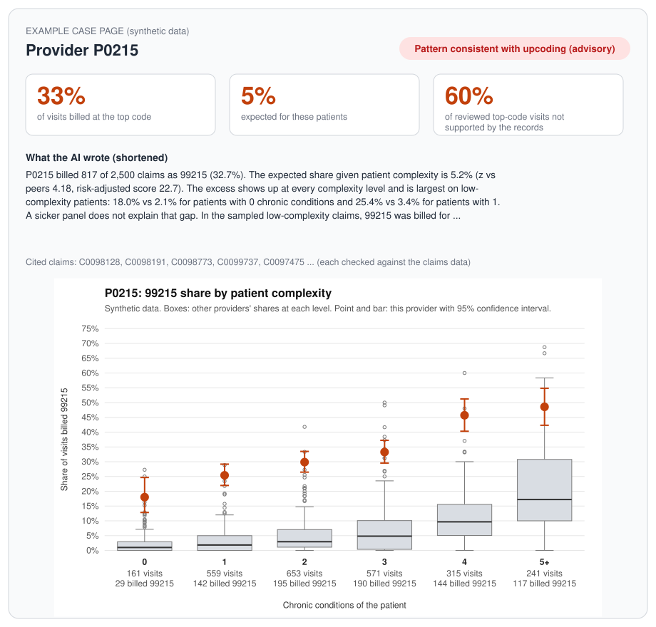
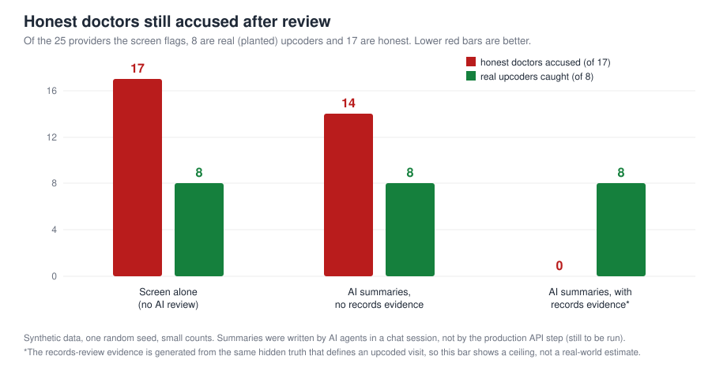

# Catching billing upcoding with AI-assisted review

**A proof of concept that finds doctors who may be billing for more complex visits than they delivered, explains why in plain language with evidence a reviewer can check, and prepares the follow-up for the team that recovers money. It tells those doctors apart from honest ones who simply treat sicker patients.**

Everything here runs on **synthetic (invented) data** shaped like real Medicare billing. No real patients, doctors or claims are used.



## What problem does this solve?
When you see a doctor for an ordinary office visit, the doctor bills your insurer using one of five codes (99211 to 99215). Higher codes mean a longer, more complex visit and **pay more**. **Upcoding** is billing a higher code than the visit justified. It costs health insurers and Medicare money, and teams called *payment integrity* or *special investigations* look for it.

The hard part: a doctor who bills the top code often is **not necessarily cheating**. They may just see sicker patients. A useful tool has to tell those two cases apart, and it has to show its evidence, because a wrong accusation is costly.

## What does this project do?
1. **Builds realistic practice data.** It generates a fake population of 216 family doctors in Georgia (about 100,000 visits), shaped to match public Medicare statistics. Eight are planted upcoders, eight are honest but treat unusually sick patients, and the rest are typical. Because the answer is known, the tools can be graded.
2. **Screens for outliers.** Statistics flag doctors who bill the top code unusually often, adjusted for how sick their patients are. The most unusual go to a reviewer: the top 25, or everyone above a chosen suspicion level.
3. **Writes a case summary and a recommendation.** An AI reads each flagged doctor's billing pattern and records evidence, writes a short explanation that **cites the exact visits** it relies on, and advises whether the case looks like upcoding, like a sicker patient base, or is unclear.
4. **Checks the AI.** Plain code rejects any summary that cites a visit that does not exist or belongs to a different doctor.
5. **Shows the evidence.** Each case gets a chart comparing the doctor to peers, and a case page a reviewer can read in a minute.
6. **Hands off to recovery.** For the cases that look like upcoding, it prepares draft material for the team that recovers money: which records to request, a reproducible sampling plan, and a way to estimate the overpayment with a confidence range.

Statistics choose who gets a close look. The AI then reads each flagged doctor's evidence and advises whether the case looks like upcoding or like sicker patients. That advice is what moves a case on to the recovery step, but it is advice: people review the records and make every real decision.

## How the filtering works


The screen only says "unusual", and many honest doctors are unusual, so a second step sorts the flagged group. On this synthetic data the 8 that moved on were exactly the 8 planted upcoders; a real team would not have that answer key, which is why a person reviews the records before anything happens.

## A worked example
Two doctors the screen flagged, drawn on the same axes. Each box shows how *other* doctors bill the top code at each patient-sickness level (0, 1, 2 ... chronic conditions); the orange dot with a bar is this doctor, with a 95% confidence range.

<table>
<tr>
<td width="50%"></td>
<td width="50%"></td>
</tr>
<tr>
<td><b>P0215 (a planted upcoder).</b> Bills the top code far more than peers at every level, even for patients with no chronic conditions: 18% of those visits against 2.1% for all doctors. The AI's summary and the records sample point the same way.</td>
<td><b>P0014 (honest, sicker patients).</b> Also flagged, but two thirds of its visits are on patients with five or more chronic conditions, and at several lower levels it bills close to its peers. The summary reads this as a heavy panel, not a billing pattern.</td>
</tr>
</table>

This is what a reviewer sees for one case (summary, key numbers, cited visits and chart):



## Does it work?
Results on the synthetic data (one random seed, small counts, so read them as directional):



- The screen (statistics only) puts **8 of 8 planted upcoders** in the top 25, along with 17 honest doctors, so the screen alone cannot tell them apart.
- AI summaries that only see billing patterns still wrongly accuse **14 of the 17** honest doctors. From billing data alone, an honest high biller and an upcoder can look the same.
- Adding a sample of **records-review evidence** (what the medical record says the visit supported) brings that to **0 of 17**, with the AI saying "inconclusive" when too few records exist. **This last result is a ceiling, not a forecast:** the records evidence is generated from the same hidden truth that defines an upcoded visit, so it makes the problem easier by construction.
- In the latest run every cited visit was real: **230 of 230** citations passed the check. The check confirms the visits exist and belong to the doctor, not that each one supports the sentence citing it.
- **The real pipeline run:** the project's own API step (Claude Opus 5.5) wrote the 25 summaries with the records evidence and got the same result: all 8 real upcoders called upcoding, 0 of 17 honest doctors, 3 of 3 sicker-panel doctors read as a heavy panel, and **261 of 261** citations real. The first two AI bars above came from agents in a chat session.
- **A held-out check:** I froze the code, generated a brand-new dataset and ran the whole pipeline once, with no tuning. The headline held: all 8 real upcoders called upcoding, 0 of 17 honest doctors accused, 278 of 278 citations real. It is still the same data generator and the same kind of records evidence, so it is a check on tuning, not on real-world difficulty (details in `experiments/261009_2_api/`).
- **Quality is not yet at the bar I set.** An independent AI grader (a different model, using a written 1-to-5 rubric) averaged **3.4 out of 5** on how useful the summaries are, against a target of 4. The usual complaints were small numeric slips, a cited visit that does not quite fit the sentence citing it, and headlines that lean a little too hard. The grader is itself an AI and makes mistakes, so this is a rough check, not a verdict.

## Built responsibly
- **Synthetic data only.** No real patients, doctors or claims, and no real provider is ever flagged.
- **The AI advises; people decide.** Statistics choose who is reviewed. The AI sorts the flagged cases (upcoding, sicker patients, or unclear) as advice to a reviewer, and nothing happens to anyone without a person checking the records.
- **A guardrail on the AI.** Invented evidence is rejected automatically.
- **Honest reporting.** The reports state what is easier by construction, what is simulated, and where the data is thin.
- **Nothing here accuses anyone.** The recovery packet is draft material for human, compliance and legal review. It does not write demand letters or make findings.

## What this project demonstrates
- Framing an open-ended problem (fraud versus legitimate complexity) as something measurable.
- Designing and calibrating synthetic data against public Medicare statistics so a method can be graded against a known answer.
- Evaluation design and candid reporting: baselines, a ground-truth answer key kept apart from the tools, results tables with caveats, and a log of what went wrong (see the experiment READMEs).
- Putting an LLM in a pipeline with guardrails and tests, rather than trusting its output.
- Building for the downstream user: charts a reviewer can read, and a packet the recovery team can act on.
- Test-driven delivery: 7 test files, and work tracked as GitHub issues grouped into milestones.

## Glossary
| Term | Meaning |
|---|---|
| E/M visit | An ordinary office visit (evaluation and management) that a doctor bills by complexity |
| CPT 99211 to 99215 | Five billing codes for established-patient office visits; a higher number means a more complex, higher-paying visit; 99215 is the top |
| Upcoding | Billing a higher visit code than the visit justified |
| Medical decision-making (MDM) | The doctor's documented reasoning that supports a visit's level |
| Medicare | US government health insurance; its public billing statistics shape the synthetic data |
| Payment integrity | The team that checks claims were paid correctly and recovers overpayments |
| SIU | Special Investigations Unit: reviewers who look into suspected billing abuse |
| Synthetic data | Invented data with realistic statistical shape, so no real person is involved |
| Z-score | How far a number sits from the average, in units of typical variation |
| Confidence interval | A range that likely contains the true value |
| Guardrail | An automatic check that blocks bad output |
| LLM | "Large language model": the kind of AI that writes the case summaries |
| Hard negative | An honest provider who looks suspicious at first glance |

## Explore the repo
- **Case pages (the review queue):** [experiments/261009_1_api/cases/index.md](experiments/261009_1_api/cases/index.md), with charts in [experiments/261009_1_api/charts/](experiments/261009_1_api/charts/)
- **Eval report:** [reports/eval_report.md](reports/eval_report.md)
- **Recovery packets (simulated review):** [experiments/261009_1_api/pi_packets/](experiments/261009_1_api/pi_packets/), explained in [docs/payment_integrity.md](docs/payment_integrity.md). Each run keeps its own charts, case pages and packets in its folder, so a later run never overwrites them.
- **Data design and calibration notes:** [docs/synthetic_data.md](docs/synthetic_data.md)
- **Experiments and what they do and do not show:** [experiments/README.md](experiments/README.md)
- **Open and closed work:** the GitHub issues and milestones for this repository

To rebuild the figures above: `python docs/make_figures.py`.

---

## For technical readers

### The bet
Statistics find outliers, but a raw outlier is not an upcoder: some providers legitimately see sicker patients. Two jobs, two tools:
- **The statistical screen selects.** It uses the numeric signal, billed level versus what patient complexity predicts, to choose who gets a close look.
- **The LLM then reads and sorts.** For each selected provider it reads structured evidence (patient complexity, sample visits, and a records-review sample giving each sampled visit's documented level and minutes) and writes a cited summary with an advisory leaning (upcoding, high-acuity panel, or inconclusive). That leaning is what separates real upcoders from honest doctors with sicker patients, and it decides which cases move on to the recovery packet. It does not set the flag, and it is not a verdict: people review the records.

In the live runs most of the separation came from the records-review evidence, not from the billing numbers alone. "Path A", an LLM judging from free-text clinical notes, is parked (see Roadmap); today's evidence is structured, not free text.

### Approach
1. **Baselines** - realistic E/M level mix for Family Practice in GA, from CMS's public *Medicare Physician & Other Practitioners - by Provider and Service* file (aggregated, no PHI).
2. **Synthetic data** - ~200 normal providers, 8 planted upcoders, 8 hard negatives (high 99215 share explained by sicker panels), with synthetic patients and claim lines, calibrated to the CMS distribution.
3. **Detectors** (the main metric is each provider's 99215 share):
   - *Baseline 1*: plain z-score of 99215 share against peers.
   - *Baseline 2*: risk-adjusted observed-versus-expected, using patient complexity (visit-weighted chronic-condition count).
4. **Flagging** - choose who goes to review: by default the top N (25), or every provider at or above a chosen suspicion level (`python src/flagging.py ... --min-suspicion 5`, with optional `--max-flagged` and `--min-claims`). A threshold flags fewer, better-targeted providers and cuts the number of AI calls; see `docs/threshold_sweep.md` for what each cutoff would flag.
5. **Case summaries (LLM)** - for each flagged provider, summarise the claims and patient complexity as `{decision_rationale, cited_claim_ids[]}`. The LLM does not set the flag (the screen does); it advises, and its advice gates the recovery packet.
6. **Guardrail** - rejects any summary citing claim IDs that don't exist for that provider.

### Eval
Every run is graded against the same thresholds. How each is computed is in `eval/`; per-run detail tables are in `reports/eval_report.md`.

| Eval | Threshold |
|---|---|
| False negative rate | at most 12.5% of the real upcoders missed (1 of 8) |
| False positive rate | at most 12.5% of the honest doctors a step examines are wrongly accused. For the screen that is all honest doctors in the data; for the AI step it is the honest doctors the screen sent to it. "Honest" means every non-upcoder, ordinary doctors and sicker-panel doctors alike |
| Precision of "upcoding" calls | at least 80% are real upcoders (*proposed*; the end-to-end check on how trustworthy an accusation is, which the screen's false positive rate does not capture) |
| Citations valid | 100% |
| Case Summary Usefulness (1-5) | average of at least 4 (scored by an LLM judge) |
| No templating | the templating check finds none |

Note that in the synthetic data, billed level depends on patient complexity by construction, so the risk-adjusted baseline is helped by how the data was built. Report that plainly.

### Status
Done: synthetic data generator (with a records-review documentation sample), both baselines, flagging, case-summary step (run live on the API), citation guardrail, evidence charts and case pages, Payment Integrity packet, eval harness (detectors, LLM leanings, templating check, LLM-judge usefulness), a held-out run.

Each run scored against the thresholds above. Screen rows show the statistical screen alone (its flagged doctors count as accused); the other rows show what the AI called upcoding. A dash means not scored or not applicable and is left out of the total.

<!-- scoreboard:start -->
| Run | False negative rate | False positive rate | Precision of upcoding calls | Citations valid | Case Summary Usefulness (1-5) | No templating | Evals passed |
|---|---|---|---|---|---|---|---|
| **Threshold** | at most 12.5% | at most 12.5% | at least 80% (proposed) | 100% | at least 4 | none | every eval that applies |
| Screen alone, seed 42 (no AI) | 0.0% (0 / 8) ✓ | 8.2% (17 / 208) ✓ | 32% ✗ | – | – | – | **2 / 3** |
| Screen with suspicion at or above 5, seed 42 (no AI) | 0.0% (0 / 8) ✓ | 1.4% (3 / 208) ✓ | 73% ✗ | – | – | – | **2 / 3** |
| 261008_2_cc: one agent for all 25 (templated) | 12.5% (1 / 8) ✓ | 58.8% (10 / 17) ✗ | 41% ✗ | 100% ✓ | – | templated ✗ | **2 / 5** |
| 261008_3_cc: chat agents, no records evidence | 0.0% (0 / 8) ✓ | 82.4% (14 / 17) ✗ | 36% ✗ | 100% ✓ | – | none ✓ | **3 / 5** |
| 261008_4_cc: chat agents, with records evidence | 0.0% (0 / 8) ✓ | 0.0% (0 / 17) ✓ | 100% ✓ | 100% ✓ | – | none ✓ | **5 / 5** |
| **261009_1_api: live API run, seed 42** | 0.0% (0 / 8) ✓ | 0.0% (0 / 17) ✓ | 100% ✓ | 100% ✓ | 3.44 ✗ | none ✓ | **5 / 6** |
| Screen alone, seed 101 (no AI) | 0.0% (0 / 8) ✓ | 8.2% (17 / 208) ✓ | 32% ✗ | – | – | – | **2 / 3** |
| Screen with suspicion at or above 5, seed 101 (no AI) | 0.0% (0 / 8) ✓ | 0.5% (1 / 208) ✓ | 89% ✓ | – | – | – | **3 / 3** |
| **261009_2_api: held-out API run, seed 101** | 0.0% (0 / 8) ✓ | 0.0% (0 / 17) ✓ | 100% ✓ | 100% ✓ | 3.24 ✗ | none ✓ | **5 / 6** |
<!-- scoreboard:end -->

This table is generated from the saved outputs (`python docs/update_readme.py`). Usefulness is scored by an LLM judge (`eval/judge_usefulness.py`, a different model from the writer), so it is a rough rubric check. Run outputs are in `experiments/`; the naming is explained in `experiments/README.md`.

### Roadmap
<!-- roadmap:start -->
Live from this repository's [milestones](https://github.com/simmyhundal/em-upcoding-agent/milestones); each badge shows the milestone's current title and closed/total issues.

-  Statistics choose who gets a close look; an AI reads each flagged provider's evidence, writes a cited summary and gives an advisory leaning (upcoding, high-acuity panel, inconclusive); code checks the citations; people decide.
-  An LLM judges from synthetic free-text clinical notes instead of structured evidence.
-  Follow-on features once the Path B PoC (Milestone 1) is evaluated: evidence visuals for reviewers and a downstream artifact for the Payment Integrity team.
-  Cut the cost per run (about $2.14 for the first full run: $1.49 Claude Opus 5.5 writer, $0.65 Claude Sonnet 5.5 judge) without losing quality.
<!-- roadmap:end -->

### Repo layout
```
data/baselines/   CMS-derived specialty distributions (small, no provider-level rows)
data/synthetic/   generated providers, patients, claims (regenerated from a seed)
src/              baseline builder, data generator, detectors, summary step
eval/             eval harness and rubric
reports/          results and failure-mode write-ups
```

### Baseline data caveats
`data/baselines/em_specialty_baselines.json` is built by `src/build_baselines.py` from the CMS file above. Read these before relying on it:
- **Small-cell suppression distorts the mix.** CMS hides provider-code rows with 10 or fewer beneficiaries, so low-volume codes drop out. Shares of higher codes are biased, and many providers show zero 99215 only because it is hidden. Treat the shares as biased, not as true billing mix.
- **Not a national sample.** The committed baseline covers all individual providers in five states (OH, NC, WA, GA, MI), not a random national draw. The GA Family Practice pull is the calibration target for the synthetic data.
- **Data year is unverified.** The JSON records `UNVERIFIED` until the release year is confirmed on data.cms.gov.
- **Office-visit codes only.** Established-patient 99211-99215; new-patient codes (99202-99205) are excluded.
- **Privacy.** NPIs are used only to group rows, then replaced by a discarded salted hash. Only aggregate distributions are saved; no provider-level rows.

### Evidence charts and case pages
`python src/evidence_chart.py data/synthetic reports/flagged.csv reports/charts` draws one SVG per flagged provider: boxes show how
the other providers' 99215 share varies at each patient-complexity level, and the provider is a point with a 95% Wilson interval
(thin levels are hollow and dashed). `python src/case_report.py CHECKED_SUMMARIES CHARTS_DIR OUT_DIR` builds a markdown page per
provider that combines the summary, its cited claims and the chart; see `experiments/261008_4_cc/cases/` for an example.

### Payment Integrity packet
`src/pi_packet.py` turns an "upcoding" case into draft material for the Payment Integrity team: a dossier, a reproducible sample of
claims to request records for, a sampling plan, and an overpayment estimator that extrapolates a reviewed sample with a confidence
interval. It does not draft letters or make findings. See `docs/payment_integrity.md`; worked examples (simulated review) are in
`reports/pi_packets/`.

### Guardrail scope
`src/guardrail.py` checks that every cited claim ID exists and belongs to the provider being summarized, and rejects summaries
with no citations. It does **not** check that a cited claim supports the sentence that cites it. For example, a summary could
call a visit "high-acuity" while citing a claim on a patient with no chronic conditions, and still pass. So 100% citation
accuracy means "no invented or misattributed claims", not "every statement is supported". Reviewers should treat the cited
claims as pointers to check. A lightweight support check (verifying numeric attributes a rationale states about cited claims)
has not been built.

### Ground rules
- Synthetic data only. No real claims, no PHI.
- Never flag real, named providers, even from public data.
- Synthetic claims are cleaner than real ones, and patient complexity is a simplified proxy for documentation. Results don't transfer directly to production.
