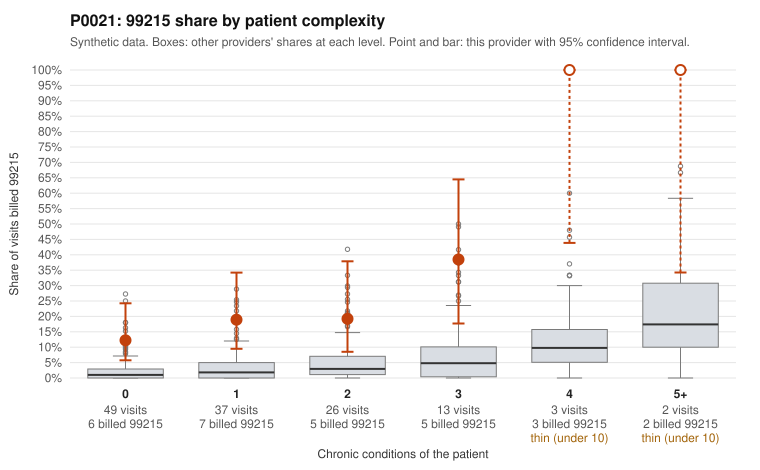

# P0021: P0021 (Family Practice, GA) bills 99215 far above its complexity-adjusted expectation, but the sampled documentation largely supports the billed level

**Leaning (advisory):** Pattern consistent with a high-acuity panel

## Why

P0021 bills 99215 on 21.5% of 130 claims, against an expected 2.8% given patient complexity (z = 2.46, risk-adjusted score 4.78). The excess shows up in every complexity stratum, including patients with few conditions: 12.2% vs 2.1% for 0 conditions and 18.9% vs 3.4% for 1 condition. The sampled low-complexity 99215s include C0011002 (back pain, M54.50), C0011031 and C0011046 (abdominal pain, R10.9), and repeat 99215s for one hypothyroid patient (C0010993, C0011060, C0011088). On its own, that would be a pattern consistent with upcoding. The records review points the other way, though. Only 1 of 10 documented 99215 claims was unsupported (10%), compared with 24.2% across all providers. That one claim is C0011002, documented at moderate MDM and 30 minutes. Lower levels also compare well: 99214 is 3.6% unsupported vs 8.4%, and 99213 is 0% vs 7.5%. Several 99215s have documented high MDM and 43-52 minutes, including C0011032, a low-complexity osteoarthritis patient, and C0011068. Taken together, the documentation is consistent with visits that are genuinely complex even though chronic-condition counts look low. The caveat is that this rests on only 10 documented 99215 claims (37.7% of all claims have records), so the conclusion is tentative, not settled.

## Evidence chart

## Cited claims

`C0011002`, `C0011031`, `C0011046`, `C0010993`, `C0011060`, `C0011088`, `C0011032`, `C0011068`, `C0011024`, `C0011071`

## Suggested next steps

- Expand the records review to more of the 28 billed 99215 claims, prioritizing the undocumented low-complexity ones (e.g., C0011031, C0011046, C0011077, C0011096, C0011036), to confirm the low unsupported rate holds.
- Review the repeat 99215 visits for patient P0021-N0013 (hypothyroidism: C0010993, C0011060, C0011088) for clinical justification of high MDM.
- Check whether documented minutes and MDM elements look templated or cloned across 99215 notes, which could inflate apparent support.
- Look for acute or episodic drivers (diagnoses, test orders, referrals, ED or admission avoidance) that could explain high-complexity visits on patients with few chronic conditions.
- Re-assess after the larger documentation sample; escalate only if the 99215 unsupported rate rises toward or above the 24.2% all-provider rate.

---
Citations checked: 10/10 valid. Synthetic data. The leaning is advisory; the flag comes from the statistical screen, and no clinical documentation is available beyond the sampled records-review facts shown in the packet.
