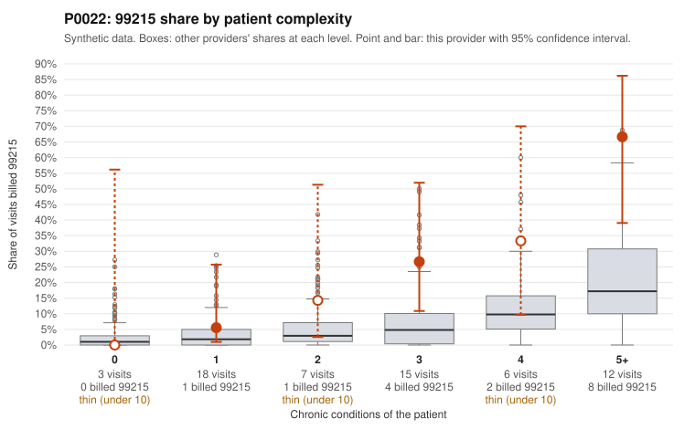

# P0022: P0022 (Family Practice, GA): elevated 99215 share largely concentrated on complex patients, but above peers in every complexity stratum; documentation too thin to judge

**Leaning (advisory):** Inconclusive

## Why

P0022 billed 16 of 61 claims (26.2%) as 99215 against an expected 7.2% given patient complexity (z = 3.18, risk-adjusted score 2.17). Much of this tracks a sicker panel: 8 of 12 visits for patients with 5+ chronic conditions were billed 99215, and only 1 of 21 visits on 0-1-condition patients was (C0011177, hyperlipidemia with abdominal pain). Sampled 99215s such as C0011119, C0011147 and C0011175 are on patients with 4-7 chronic conditions. However, the provider's 99215 share is roughly double the all-provider rate in every stratum (e.g. 66.7% vs 29.8% at 5+, 26.7% vs 8.7% at 3), so complexity does not fully explain the pattern. Documentation review covers only 3 of the 99215 claims: one was unsupported (C0011136, documented moderate MDM, 36 minutes), and two were supported (C0011135 and C0011152, high MDM, 42 and 51 minutes). That is a 33% unsupported rate against 24.2% for all providers, but three claims are too few to judge. Overall the pattern is consistent with a high-acuity panel plus possible level inflation within strata. Neither reading can be confirmed from this packet.

## Evidence chart

## Cited claims

`C0011177`, `C0011119`, `C0011147`, `C0011175`, `C0011136`, `C0011135`, `C0011152`

## Suggested next steps

- Request records for more of the 16 billed 99215 claims, especially repeat visits for patient P0022-N0014 (C0011119, C0011136, C0011139, C0011169), and check MDM and time against 99215 requirements.
- Review C0011177 (99215 on a 1-condition patient) to see whether the documented MDM supports high complexity.
- Compare within-stratum 99214 vs 99215 billing for similar patients (e.g. C0011127 billed 99214 vs C0011131 billed 99215 for the same patient P0022-N0006) to check that level selection is consistent.
- Look at the 99213 and 99214 documentation mismatches (C0011173, C0011138) to see whether there is a general overcoding tendency or just documentation noise.
- Confirm that the chronic-condition counts are backed by active diagnoses being managed at the visits, since claim diagnosis codes often list only 1-3 codes.

---
Citations checked: 7/7 valid. Synthetic data. The leaning is advisory; the flag comes from the statistical screen, and no clinical documentation is available beyond the sampled records-review facts shown in the packet.
