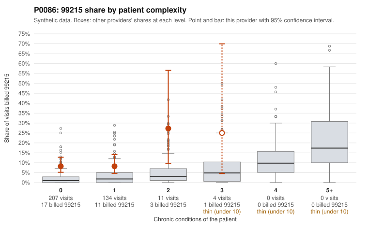

# P0086: P0086 (Family Practice, GA): elevated risk-adjusted 99215 share, but sampled documentation supports the billed levels

**Leaning (advisory):** Pattern consistent with a high-acuity panel

## Why

The risk-adjusted screen flagged P0086 because 8.99% of claims (32 of 356) are 99215, against an expected 1.65% given patient complexity. The peer z-score is only 0.53. Most 99215s fall on low-complexity patients: 17 of 207 visits with 0 chronic conditions (8.2% vs 2.1% for all providers) and 11 of 134 visits with 1 condition (8.2% vs 3.4%). No 99215s were billed on patients with 4 or more conditions. Sampled examples include C0042015 (rash only) and C0042225 (upper respiratory infection). On its own, that would be a concern. The records review points the other way, though. None of the 9 documented 99215 claims was unsupported (0% vs 24.2% for all providers). Examples are C0042010, C0042080, C0042274 and C0042310, each with high MDM and 44-54 minutes. The 99214 unsupported rate (5.1%, 3 of 59, e.g. C0042130) and the 99213 rate (0 of 40) are also below the all-provider rates. Overall, the pattern is consistent with legitimately complex visits that chronic-condition counts do not capture, not with upcoding. One caveat: only 9 of the 32 99215s are documented, so this conclusion is tentative.

## Evidence chart

## Cited claims

`C0042015`, `C0042225`, `C0042010`, `C0042080`, `C0042274`, `C0042310`, `C0042130`

## Suggested next steps

- Request records for more of the undocumented 99215 claims, starting with low-complexity visits such as C0042015, C0042225, C0042303 and C0042329, to confirm the 0% unsupported rate holds on a larger sample.
- Check whether documented MDM for low-complexity 99215 visits reflects acute severity (e.g., workup, data review, risk of management) rather than time or chronic-condition burden.
- Review the three 99214 claims with low documented MDM (C0042130, C0042187, C0042197) for any recurring documentation or coding-habit issue.
- Re-run the screen once more documentation is available; if supported rates stay near current levels, consider closing or deprioritizing the case.

---
Citations checked: 7/7 valid. Synthetic data. The leaning is advisory; the flag comes from the statistical screen, and no clinical documentation is available beyond the sampled records-review facts shown in the packet.
