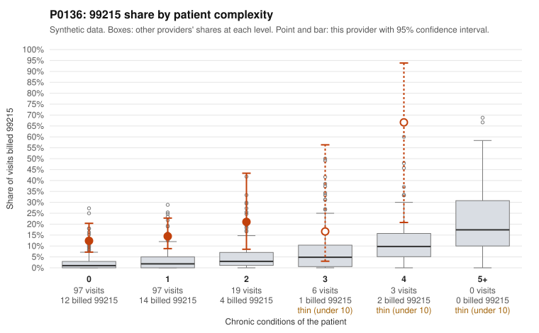

# P0136: P0136 (Family Practice, GA): 99215 share is far above what patient complexity predicts, but the few documented 99215 claims all support the billed level, so the result is inconclusive

**Leaning (advisory):** Inconclusive

## Why

P0136 billed 33 of 222 claims (14.9%) as 99215. Patient complexity predicts about 2.0%. The excess is concentrated in low-complexity visits: 12.4% vs 2.1% all-provider for patients with 0 chronic conditions, and 14.4% vs 3.4% for patients with 1. The sample includes many 99215s on simple presentations, for example C0064025 and C0064176 (J06.9 upper respiratory infection, no chronic conditions) and C0063984 (M54.50 low back pain). On claims data alone, this pattern is consistent with upcoding. The records review points the other way, but it is thin. Only 4 of the 99215 claims have documentation, and all 4 support the billed level with high MDM and 43 to 48 minutes. The all-provider unsupported rate for 99215 is 24.2%. All 4 of these supported claims are on low-complexity patients: C0064003, C0064060, C0064124 and C0064186. Four claims is too few to judge whether the 99215 billing is supported. Elsewhere, 99214 documentation looks normal: 2 of 38 unsupported (5.3% vs 8.4%). 99213 runs higher, at 3 of 16 unsupported (18.8% vs 7.5%), for example C0063995, but that sample is small too. Most of this provider's 99215 records have not been reviewed, so whether the billing is supported is still unresolved.

## Evidence chart

## Cited claims

`C0064025`, `C0064176`, `C0063984`, `C0064003`, `C0064060`, `C0064124`, `C0064186`, `C0063995`

## Suggested next steps

- Pull and review records for a larger sample of the 99215 claims, starting with those on patients with 0 to 1 chronic conditions and a single acute diagnosis (e.g., C0064025, C0064176, C0063984, C0064028, C0064037).
- Check whether the MDM and time documentation on the supported 99215 claims (C0064003, C0064060, C0064124, C0064186) is specific to the encounter or templated or cloned across visits.
- Verify whether documented minutes reflect face-to-face or qualifying time, and look for prolonged or complex workups (labs, imaging, referrals) that would justify high MDM on visits for routine diagnoses such as N39.0 and R10.9.
- Review the 99213 claims documented below the billed level (e.g., C0063995, C0064041, C0064109) to see whether there is a broader pattern of level inflation.
- Compare this provider's 99215 use for repeat patients (e.g., P0136-N0005, P0136-N0011, P0136-N0061) over time.

---
Citations checked: 8/8 valid. Synthetic data. The leaning is advisory; the flag comes from the statistical screen, and no clinical documentation is available beyond the sampled records-review facts shown in the packet.
