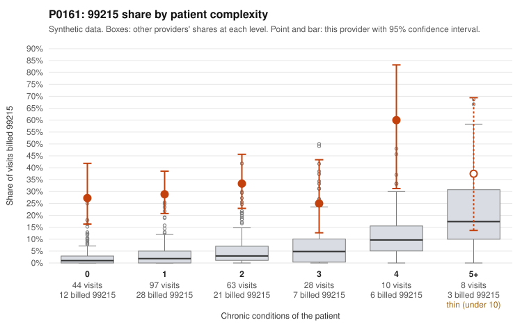

# P0161: Family Practice provider P0161: 30.8% 99215 share (vs 3.2% expected) concentrated on low-complexity patients, with 75% of documented 99215 claims unsupported

**Leaning (advisory):** Pattern consistent with upcoding

## Why

P0161 billed 99215 on 30.8% of 250 claims against an expected 3.2% given patient complexity (z = 3.89, risk-adjusted score 9.0). The elevation is not explained by acuity: 99215 share is 27.3% for patients with 0 chronic conditions and 28.9% with 1 condition (vs 2.1% and 3.4% for all providers), and sampled low-complexity 99215 claims include routine-appearing presentations such as rash (C0073067, C0073103), UTI (C0073101, C0073108), abdominal pain (C0073075), and follow-up (C0073162). The records review points the same way: 12 of 16 documented 99215 claims (75%) did not support the billed level, roughly three times the 24.2% all-provider rate, with examples documenting only moderate MDM at 30-37 minutes (C0073057, C0073105, C0073176, C0073242). 99214 also shows 27.5% unsupported (11 of 40) vs 8.4%, for example C0073277 on a 0-condition patient with low MDM. Some 99215s are supported by high-MDM documentation (C0073109, C0073230), and the documented 99215 sample is small (16 claims), so this is a pattern consistent with upcoding rather than a finding of fraud.

## Evidence chart

## Cited claims

`C0073067`, `C0073103`, `C0073101`, `C0073108`, `C0073075`, `C0073162`, `C0073057`, `C0073105`, `C0073176`, `C0073242`, `C0073277`, `C0073109`, `C0073230`

## Suggested next steps

- Pull full medical records for the remaining 61 undocumented 99215 claims, prioritizing 0-1 condition patients (e.g., C0073067, C0073101, C0073075, C0073162), and score MDM/time against 2021 E/M guidelines.
- Expand documentation review of 99214 claims given the 27.5% unsupported rate, to assess whether level inflation is systematic across levels.
- Check whether documented minutes on 99215 claims meet the 40-minute time threshold and whether time statements are templated or cloned.
- Review the 4 supported 99215 examples to confirm high MDM is genuine and not boilerplate.
- Compare the provider's diagnosis coding and problem lists to claims history to verify chronic condition counts are not understated or overstated.
- Consider a statistically valid random sample for extrapolation before any overpayment determination.

---
Citations checked: 13/13 valid. Synthetic data. The leaning is advisory; the flag comes from the statistical screen, and no clinical documentation is available beyond the sampled records-review facts shown in the packet.
