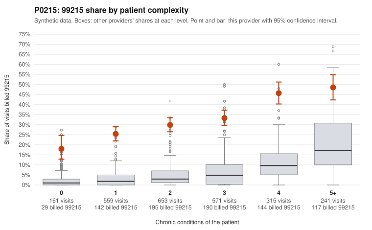

# P0215: P0215 (Family Practice, GA): 99215 share of 32.7% vs 5.2% expected; 59.8% of documented 99215 claims are unsupported, pattern consistent with upcoding

**Leaning (advisory):** Pattern consistent with upcoding

## Why

P0215 billed 817 of 2,500 claims as 99215 (32.7%). The expected share given patient complexity is 5.2% (z vs peers 4.18, risk-adjusted score 22.7). The excess shows up at every complexity level and is largest on low-complexity patients: 18.0% vs 2.1% for patients with 0 chronic conditions and 25.4% vs 3.4% for patients with 1. A sicker panel does not explain that gap. In the sampled low-complexity claims, 99215 was billed for single, routine diagnoses such as rash (C0098128, C0098191), upper respiratory infection (C0098773, C0099737) and uncomplicated hypertension or diabetes (C0097475, C0098009). The documentation review is large enough to judge: 234 billed 99215 claims were documented, and 140 of them (59.8%) did not support the billed level, against 24.2% for all providers. Examples are C0098676 and C0098775, both documented as moderate MDM at 30-31 minutes. 99214 claims were also unsupported at 19.0% vs 8.4%. Some 99215 claims are well supported (for example C0098276 and C0098923, high MDM at 42-47 minutes), and the 4+ condition patients (for example C0097886, C0099387) plausibly justify some high-level visits. Records cover only 29.5% of claims and the claim lists are samples, so this is a pattern consistent with upcoding, not a finding of fraud.

## Evidence chart

## Cited claims

`C0098128`, `C0098191`, `C0098773`, `C0099737`, `C0097475`, `C0098009`, `C0098676`, `C0098775`, `C0098276`, `C0098923`, `C0097886`, `C0099387`

## Suggested next steps

- Pull full medical records for the sampled low-complexity 99215 claims (e.g., C0098128, C0098191, C0098773, C0099737, C0097623) and check MDM elements and time against 99215 requirements.
- Extend the documentation review to the 140 unsupported 99215 claims and the 72 unsupported 99214 claims to see whether the variance is systematic or limited to certain dates or diagnoses.
- Check whether 99215 claims rely on time-based billing, and whether the documented minutes (often around 30) meet the 99215 time threshold.
- Compare the provider's coding over time and against peers in the same practice to see if there is a template or EHR default driving high-level coding.
- Consider a provider education contact or a prepayment review if the expanded audit confirms the unsupported rate.

---
Citations checked: 12/12 valid. Synthetic data. The leaning is advisory; the flag comes from the statistical screen, and no clinical documentation is available beyond the sampled records-review facts shown in the packet.
