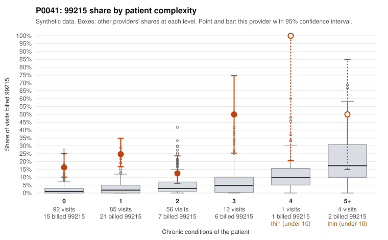

# Payment Integrity dossier: P0041

> Draft for human review. Statistical and records-sample evidence only; not a finding. Compliance or legal review is needed before any provider contact, notice or recoupment.

## Provider overview

| | |
|---|---|
| Specialty / state | Family Practice, GA (synthetic) |
| Claims / patients | 250 / 100 |
| Billed mix (99211 to 99215) | 1 / 3 / 48 / 146 / 52 |
| 99215 share | 20.8% |
| Expected 99215 share given patient complexity | 2.5% |
| Screen scores | z vs peers 2.35; risk-adjusted 6.73; flagged by zscore+riskadj |

## Case summary (advisory)

**P0041 (Family Practice, GA): 99215 share of 20.8% vs 2.5% expected for its panel, concentrated in low-complexity patients, and 11 of 16 documented 99215 claims unsupported, a pattern consistent with upcoding**

Leaning: pattern consistent with upcoding. Citations checked: 8/8 valid.

P0041 billed 52 of 250 claims (20.8%) as 99215. Given this panel's complexity, about 2.5% would be expected (z vs peers 2.35, risk-adjusted score 6.73). Most of these visits are on low-complexity patients. 36 of the 52 claims at 99215 went to patients with 0-1 chronic conditions: 16.3% vs 2.1% for all providers at 0 conditions, and 24.7% vs 3.4% at 1 condition. Sampled examples carry routine diagnoses such as Z09 follow-up, back pain (M54.50), UTI (N39.0), rash (R21) and abdominal pain (R10.9) (e.g., C0020325, C0020335, C0020497). Only 5 visits are on patients with 4+ conditions, so a sicker panel does not explain the share. The documentation points the same way. Of 16 documented 99215 claims, 11 (68.8%) do not support the billed level, vs 24.2% for all providers. Examples are C0020348 and C0020410, both moderate MDM at 36 minutes, and C0020438, moderate MDM at 37 minutes, all on 0-1 condition patients. Some 99215s are supported (e.g., C0020443, C0020394, high MDM). 99214 claims are also unsupported more often than average (14.6% vs 8.4%). Caveats: only 28% of claims have records, the documented 99215 sample is small (n=16), and claim lists are random samples. This pattern is consistent with upcoding but is not proof of it.

## Evidence chart

## Records-review sample so far

Documentation is on file for 70 claims (28% of this provider's claims).

| Billed | Documented | Documentation below billed level | Rate | All-provider rate |
|---|---|---|---|---|
| 99213 | 12 | 0 | 0.0% | 7.5% |
| 99214 | 41 | 6 | 14.6% | 8.4% |
| 99215 | 16 | 11 | 68.8% | 24.2% |

## Recommended next steps for Payment Integrity

1. Request records for the sampled claims in `record_request_list.csv` (30 claims across 99215).
2. Review the records against E/M documentation rules and record the supported level for each claim.
3. Run the overpayment estimator on the reviewed sample (`sampling_plan.md` explains how).
4. Notice, appeal rights, recoupment, education or corrective action, and any referral are decisions for the PI team, compliance and counsel. Nothing here drafts those.

Suggested follow-ups from the case summary:

- Pull full records for all 52 99215 claims, starting with those on 0-1 condition patients, and check MDM elements and total time against 99215 requirements.
- Expand the documentation sample beyond 16 99215 claims to confirm the 68.8% unsupported rate.
- Review 99214 claims documented at low MDM (e.g., C0020338, C0020369, C0020379, C0020459) for a broader one-level upcoding pattern.
- Check for templated or cloned notes and for time-based billing claims that lack supporting time statements.
- Compare against the provider's prior-year E/M distribution and any payer audit or education history.

## Limits

- Synthetic data; no real claims or providers.
- The leaning is advisory. The flag comes from the statistical screen; the summary explains it.
- The records-review sample is partial and was simulated for this project.
- Allowed amounts are GA Family Practice averages from a public CMS file, not this provider's actual payments.
