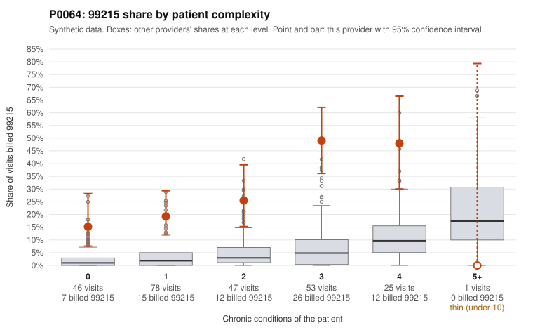

# Payment Integrity dossier: P0064

> Draft for human review. Statistical and records-sample evidence only; not a finding. Compliance or legal review is needed before any provider contact, notice or recoupment.

## Provider overview

| | |
|---|---|
| Specialty / state | Family Practice, GA (synthetic) |
| Claims / patients | 250 / 99 |
| Billed mix (99211 to 99215) | 0 / 1 / 44 / 133 / 72 |
| 99215 share | 28.8% |
| Expected 99215 share given patient complexity | 3.5% |
| Screen scores | z vs peers 3.58; risk-adjusted 7.96; flagged by zscore+riskadj |

## Case summary (advisory)

**P0064 (Family Practice, GA): elevated 99215 use across all complexity strata, with 55% of documented 99215s unsupported versus 24.2% for all providers, a pattern consistent with upcoding**

Leaning: pattern consistent with upcoding. Citations checked: 10/10 valid.

P0064 billed 99215 on 28.8% of 250 claims, against an expected 3.5% given patient complexity (z = 3.58 vs peers, risk-adjusted score 7.96). The excess is not limited to sicker patients. 99215 share is 15.2% for patients with 0 chronic conditions (all-provider rate 2.1%) and 19.2% for patients with 1 condition (3.4%). Sampled examples include rash-only (R21) or single-condition visits such as C0028395, C0028417, C0028459, C0028627 and C0028456. The documentation review points the same way. Of 20 documented 99215 claims, 11 (55%) do not support the billed level, against 24.2% for all providers. Examples include C0028395, C0028459 and C0028487, each documented as moderate MDM at 33 to 38 minutes. Documented 99214s are also unsupported at 23.3% versus 8.4%, while 99213s are in line (5.3% vs 7.5%). Some 99215s are supported (C0028470, C0028477, C0028575, C0028623 show high MDM at 42 to 51 minutes), and the provider's rates on 3 to 4 condition patients are also high. The 99215 documentation sample is modest (20 claims), and records cover only 32.8% of claims, so these findings support a targeted review rather than a conclusion.

## Evidence chart

## Records-review sample so far

Documentation is on file for 82 claims (33% of this provider's claims).

| Billed | Documented | Documentation below billed level | Rate | All-provider rate |
|---|---|---|---|---|
| 99213 | 19 | 1 | 5.3% | 7.5% |
| 99214 | 43 | 10 | 23.3% | 8.4% |
| 99215 | 20 | 11 | 55.0% | 24.2% |

## Recommended next steps for Payment Integrity

1. Request records for the sampled claims in `record_request_list.csv` (36 claims across 99215).
2. Review the records against E/M documentation rules and record the supported level for each claim.
3. Run the overpayment estimator on the reviewed sample (`sampling_plan.md` explains how).
4. Notice, appeal rights, recoupment, education or corrective action, and any referral are decisions for the PI team, compliance and counsel. Nothing here drafts those.

Suggested follow-ups from the case summary:

- Pull full records for all 99215 claims on 0-1 condition patients (e.g., C0028395, C0028417, C0028459, C0028627, C0028513, C0028531) and verify MDM elements and time against 2021 E/M guidelines.
- Expand the documentation sample beyond 20 99215 claims to confirm whether the 55% unsupported rate holds.
- Review the 99214 claims documented as low MDM (C0028446, C0028453, C0028550, C0028634) to judge whether overcoding also extends to 99214.
- Check repeat 99215 billing for the same low-complexity patients (e.g., P0064-N0081, P0064-N0061, P0064-N0038, P0064-N0009) for templated or cloned notes.
- Compare the provider's documented minutes against billed level, and check for time-based billing without supporting time attestations.

## Limits

- Synthetic data; no real claims or providers.
- The leaning is advisory. The flag comes from the statistical screen; the summary explains it.
- The records-review sample is partial and was simulated for this project.
- Allowed amounts are GA Family Practice averages from a public CMS file, not this provider's actual payments.
