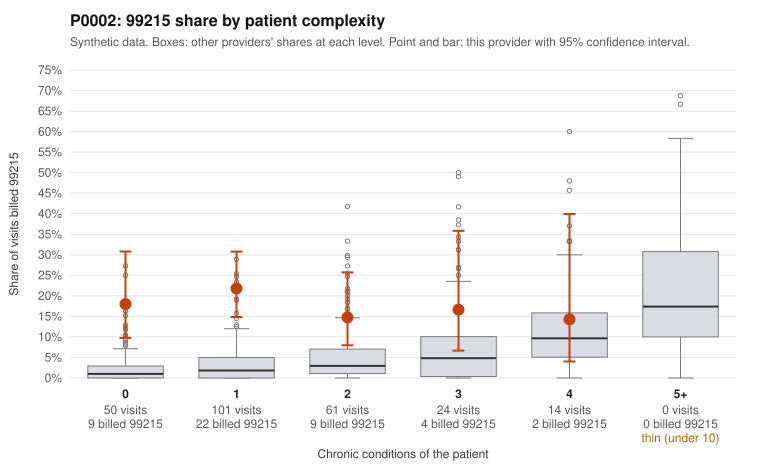

# P0002: P0002 (Family Practice, GA): 99215 billing concentrated on low-complexity patients, and most documented 99215s are not supported, a pattern consistent with upcoding

**Leaning (advisory):** Pattern consistent with upcoding

## Why

P0002 billed 99215 on 18.4% of 250 claims, against about 2.8% expected for this patient mix. The excess sits in low-complexity patients. The 99215 share is 18.0% for patients with 0 chronic conditions (all-provider rate 2.1%) and 21.8% for patients with 1 condition (3.4%). Those two groups account for 31 of the 46 99215s. For patients with 4 or more conditions, the share matches peers (14.3% vs 13.9%). Sampled low-complexity 99215s carry routine diagnoses: low back pain (C0000437), upper respiratory infection (C0000476), UTI (C0000612) and follow-up exam (C0000498). In the records review, 11 of 15 documented 99215s (73.3%) were not supported, versus 24.2% across all providers. Examples documented only moderate MDM at 31-33 minutes (C0000455, C0000469, C0000481). The 99214 unsupported rate is also elevated (16.7% vs 8.4%; e.g., C0000403, C0000407 documented low MDM), while 99213 is in line (5.3% vs 7.5%). Some 99215s are supported (C0000541, C0000593 documented high MDM), so not every high-level claim is suspect. Limits: only 71 of 250 claims (28.4%) have records, including just 15 of the 46 99215s, and the claim lists are samples.

## Evidence chart

## Cited claims

`C0000437`, `C0000476`, `C0000612`, `C0000498`, `C0000455`, `C0000469`, `C0000481`, `C0000403`, `C0000407`, `C0000541`, `C0000593`

## Suggested next steps

- Request records for the undocumented 99215 claims, starting with the 0-1 condition patients (e.g., C0000437, C0000476, C0000612, C0000498, C0000462, C0000524), to confirm the 73% unsupported rate on a larger set.
- Expand the documentation review of 99214 claims, since that unsupported rate is about double the all-provider rate.
- For the 99215s marked supported, check whether documented high MDM and 40+ minutes are credible for single-condition visits (e.g., hypertension, hyperlipidemia).
- Look for templated or cloned notes and time statements that repeat across 99215 encounters.
- Review the 99215s on the 4+ condition patient (C0000511, C0000631) as a likely legitimate comparison group.
- Have a certified coder audit a sample, and consider provider education or prepayment review if the findings hold.

---
Citations checked: 11/11 valid. Synthetic data. The leaning is advisory; the flag comes from the statistical screen, and no clinical documentation is available beyond the sampled records-review facts shown in the packet.
