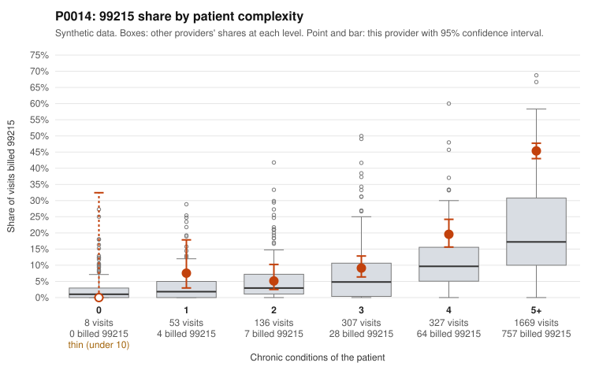

# P0014: P0014 (Family Practice, GA): elevated 99215 share on a very complex panel, with documentation largely supporting billed 99215s; pattern consistent with a high-acuity panel

**Leaning (advisory):** Pattern consistent with a high-acuity panel

## Why

P0014 billed 99215 on 34.4% of 2,500 claims, against 16.7% expected given patient complexity (z=4.44, risk-adjusted score 8.80). The panel is heavily skewed toward complex patients: 1,669 visits (67%) were for patients with 5+ chronic conditions, and 757 of the 860 99215s fall in that group. Only 4 of 61 visits for patients with 0-1 conditions were billed 99215 (e.g., C0005178, C0005487). The billing share does remain above peers within the higher strata (45.4% vs 29.8% at 5+ conditions; 19.6% vs 13.9% at 4 conditions), which is why the screen flagged the provider. The documentation review weighs against upcoding. Of 234 documented 99215 claims, only 16 (6.8%) were unsupported, well below the all-provider rate of 24.2%. Supported examples include C0005281 and C0005368, and also C0005505, a 99215 on a one-condition diabetic patient that was documented as high MDM at 43 minutes. Unsupported 99215 examples such as C0005325 and C0005559 were documented as moderate MDM at about 30 minutes, which fits the expected noise rate. One small signal is 99213 claims, unsupported at 13.1% vs 7.5%, but that is only 8 of 61 claims. Overall the pattern is consistent with a legitimately sicker panel rather than systematic upcoding. Documentation covers only 28.8% of claims.

## Evidence chart

## Cited claims

`C0005178`, `C0005487`, `C0005281`, `C0005368`, `C0005505`, `C0005881`, `C0005325`, `C0005559`, `C0006995`, `C0005131`, `C0006639`

## Suggested next steps

- Confirm the documentation sample was drawn randomly and is representative of the 5+ condition stratum, where most 99215s occur.
- Review C0006995, a 99215 one week after C0005505 for the same one-condition patient, to check whether the follow-up visit's complexity justified 99215.
- Assess why the 99215 share exceeds peers within the 4 and 5+ condition strata; check whether chronic condition counts reflect actively managed problems at each visit or only list history.
- Spot-check the 99213 unsupported claims (e.g., C0005150, C0005410, C0007340) to see whether the elevated rate reflects small-sample noise or a coding-practice issue.
- Consider lower priority for this provider unless the additional record review raises the 99215 unsupported rate toward or above the 24.2% peer benchmark.

---
Citations checked: 11/11 valid. Synthetic data. The leaning is advisory; the flag comes from the statistical screen, and no clinical documentation is available beyond the sampled records-review facts shown in the packet.
