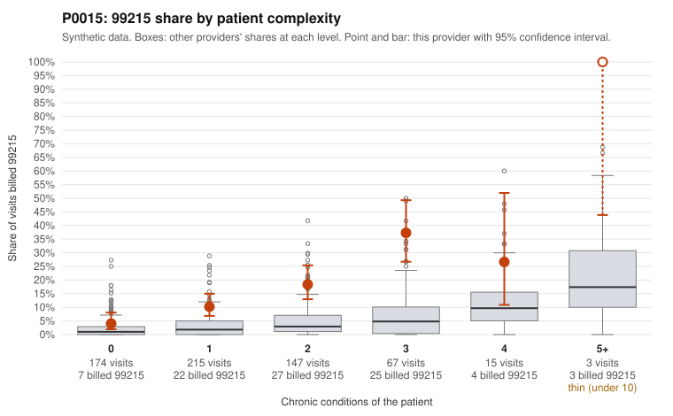

# P0015: P0015 (Family Practice, GA): 99215 share well above expected, but documented 99215 claims largely support the billed level

**Leaning (advisory):** Pattern consistent with a high-acuity panel

## Why

P0015 billed 99215 on 14.2% of 621 claims against an expected 2.6% given patient complexity (risk-adjusted score 6.52; peer z 1.33). The excess appears at every complexity level, not just among sick patients. Examples: 4.0% vs 2.1% at 0 chronic conditions, 10.2% vs 3.4% at 1, and 37.3% vs 8.7% at 3. The sampled low-complexity 99215s include visits coded only for acute URI (C0007868, C0008074) or a follow-up code (C0007512). On claims data alone, that would raise concern. The records review points the other way, though. Of 31 documented 99215 claims, only 3 (9.7%) were unsupported, versus 24.2% across all providers. Some low-complexity 99215s were documented as high MDM with more than 40 minutes: C0007796 (J06.9, no chronic conditions, 49 min) and C0007859 (atrial fibrillation, 42 min). C0007683 and C0007610 were also supported. Unsupported 99215 examples (C0007718, C0007862) were documented as moderate MDM. The 99214 unsupported rate (6.1% vs 8.4%) is also at or below peers, while 99213 is slightly higher (11.4% vs 7.5%). Overall, the pattern is more consistent with a panel whose visit acuity is not captured by chronic-condition counts than with upcoding. Two caveats apply: documentation covers only 29% of claims, and the review cannot rule out templated or inflated notes.

## Evidence chart

## Cited claims

`C0007868`, `C0008074`, `C0007512`, `C0007796`, `C0007859`, `C0007683`, `C0007610`, `C0007718`, `C0007862`

## Suggested next steps

- Have a clinical coder independently re-review a sample of documented 99215 notes on 0-1 condition patients (e.g., C0007796, C0007859) for cloned or templated text and for MDM elements that match the presenting problem.
- Pull records for undocumented low-complexity 99215 claims such as C0007868, C0008074 and C0007512 to see whether the low unsupported rate holds there.
- Check whether 99215 visits involve acute or unscheduled problems, ED follow-ups, or other acuity drivers missing from chronic-condition counts (diagnosis codes, referrals, orders, time of visit).
- Compare documented minutes and MDM distributions to peers to detect uniform or inflated time entries.
- Optionally review the 99213 unsupported cases (C0007670, C0007744, C0007869), though that rate is only modestly above peers.

---
Citations checked: 9/9 valid. Synthetic data. The leaning is advisory; the flag comes from the statistical screen, and no clinical documentation is available beyond the sampled records-review facts shown in the packet.
