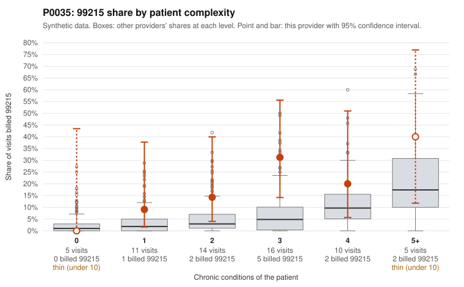

# P0035: P0035 (Family Practice, GA): 99215 share about 3x the complexity-adjusted expectation, but sampled documentation mostly supports the 99215s; leans toward a legitimately complex panel, with caveats.

**Leaning (advisory):** Pattern consistent with a high-acuity panel

## Why

P0035 billed 99215 on 19.7% of 61 claims (12 of 61), against an expected 6.0% given patient complexity (z = 2.17, risk-adjusted score 1.69). The excess appears in every stratum with any 99215s, most sharply at 3 chronic conditions (31.2% vs 8.7% for all providers), so patient complexity alone does not explain the share. The documentation review points the other way. Of 6 documented 99215 claims, only 1 was unsupported (16.7%), below the all-provider rate of 24.2%. That one was C0017160, documented as moderate MDM and 36 minutes. Supported examples include C0017161 and C0017130 (high MDM, 41 and 47 minutes). The only sampled 99215 on a low-complexity patient, C0017162 (type 2 diabetes plus UTI code), was also documented as high MDM at 44 minutes. One mild signal: 2 of 12 documented 99214s were unsupported (16.7% vs 8.4% for all providers), C0017135 and C0017156, both low MDM at about 20 minutes. Overall this pattern is more consistent with a sicker or more intensively managed panel than with systematic 99215 upcoding. However, only 6 documented 99215s from a 22-patient panel is a thin basis, and repeat visits by a few patients (e.g., P0035-N0003 in C0017114 and C0017161) may drive the share.

## Evidence chart

## Cited claims

`C0017160`, `C0017161`, `C0017130`, `C0017162`, `C0017169`, `C0017135`, `C0017156`, `C0017114`

## Suggested next steps

- Request records for the 6 undocumented 99215 claims to confirm whether the low unsupported rate holds across all 12.
- Review the 3-chronic-condition visits, where the 99215 share (31.2%) most exceeds peers, for clinical drivers such as acute exacerbations or new diagnoses.
- Expand documentation review of 99214 claims, given the 16.7% unsupported rate (about 2x the all-provider rate), to check for one-level upcoding at 99214.
- Check whether a few patients account for most 99215s (e.g., P0035-N0003) and whether their acuity during the period justifies it.
- Verify that time-based 99215 claims meet the time threshold in effect, and that MDM elements (data reviewed, risk of management) are actually present in the notes.

---
Citations checked: 8/8 valid. Synthetic data. The leaning is advisory; the flag comes from the statistical screen, and no clinical documentation is available beyond the sampled records-review facts shown in the packet.
