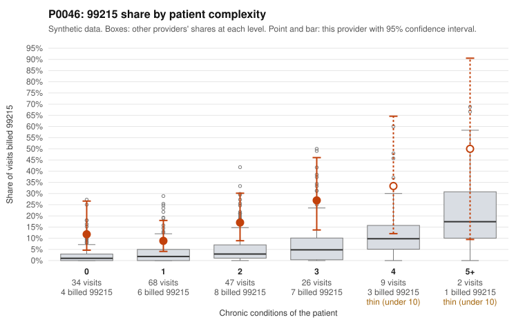

# P0046: P0046 (Family Practice, GA): 99215 share well above expected, but the documented 99215 claims all support the billed level

**Leaning (advisory):** Pattern consistent with a high-acuity panel

## Why

P0046 billed 99215 on 15.6% of 186 claims, against an expected 3.0% given patient complexity. The elevation appears in every chronic-condition stratum, including 0-condition patients (11.8% vs 2.1% for all providers). The sample includes 99215s on 0-condition patients with single routine diagnoses, such as C0022138 and C0022185 (R10.9), C0022287 (R21) and C0022264 (N39.0). On its face this is the low-complexity pattern of concern. However, the records review cuts the other way. All 7 documented 99215 claims supported the billed level (0% unsupported vs 24.2% for all providers), with high MDM and 41-54 minutes (C0022149, C0022216, C0022242). That includes C0022178, a 1-condition patient. Documented 99213s were 0/16 unsupported, and documented 99214s were 2/18 unsupported (11.1% vs 8.4%; C0022273, C0022283), which is close to the noise level. Chronic-condition counts may not capture acute visit acuity. Taken together, the evidence is more consistent with a legitimately complex workload than with upcoding. The caveat is that only 7 of 29 99215s were documented, and none of the low-complexity 99215s listed above (other than C0022178) were reviewed, so this is not conclusive.

## Evidence chart

## Cited claims

`C0022138`, `C0022185`, `C0022287`, `C0022264`, `C0022178`, `C0022149`, `C0022216`, `C0022242`, `C0022273`, `C0022283`

## Suggested next steps

- Pull records for the undocumented 99215 claims on 0-1 condition patients (e.g., C0022138, C0022185, C0022287, C0022264, C0022309, C0022218) to test whether support holds where the risk is highest.
- Expand the documentation sample for 99215s to roughly 15-20 claims so the 0% unsupported rate rests on more than 7 claims.
- Check whether acute-visit acuity (ED follow-ups, new problems with workup, time-based billing) explains 99215s on patients with few chronic conditions.
- Review the two unsupported 99214 claims (C0022273, C0022283) for a recurring documentation pattern, though their rate is near the all-provider baseline.
- Compare against same-specialty GA peers for panel mix factors not captured by chronic-condition counts (e.g., new-patient share, post-discharge visits).

---
Citations checked: 10/10 valid. Synthetic data. The leaning is advisory; the flag comes from the statistical screen, and no clinical documentation is available beyond the sampled records-review facts shown in the packet.
