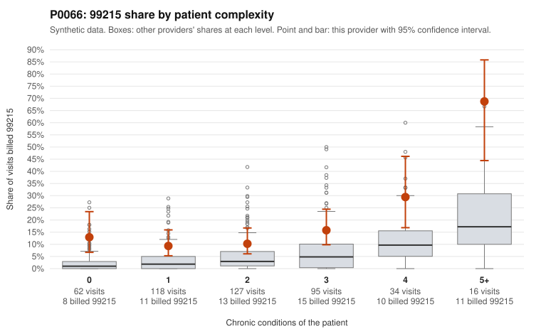

# P0066: P0066 (Family Practice, GA): 99215 share well above risk-adjusted expectation, but sampled documentation supports billed levels at or better than peer rates

**Leaning (advisory):** Pattern consistent with a high-acuity panel

## Why

P0066 billed 99215 on 15.0% of 452 claims versus 3.9% expected for its patient complexity. The excess appears in every complexity band, including patients with 0 chronic conditions (12.9% vs 2.1% for all providers), so chronic-condition counts do not explain it. Sampled low-complexity 99215s include diagnoses that usually suggest simpler visits, such as upper respiratory infection (C0029774, C0030029) and low back pain (C0030040, C0030076). The records review points the other way. Of 19 documented 99215 claims, 3 (15.8%) were unsupported, below the all-provider rate of 24.2%. Supported examples show high MDM and 41-51 minutes (C0029676, C0029912). The 99213 and 99214 unsupported rates match peers. On balance the documentation does not show upcoding, so the pattern is consistent with a higher-acuity panel, possibly driven by acute presentations that chronic-condition counts miss. This is a tentative read. Nineteen documented 99215s is a modest sample. All three unsupported 99215s (C0029709, C0029756, C0029806) are low-complexity patients documented at moderate MDM with 32-34 minutes, and we cannot tell which complexity band the supported 99215s came from.

## Evidence chart

## Cited claims

`C0029774`, `C0030029`, `C0030040`, `C0030076`, `C0029676`, `C0029912`, `C0029709`, `C0029756`, `C0029806`

## Suggested next steps

- Find out which complexity band each of the 19 documented 99215 claims falls in, to see whether low-complexity 99215s are supported at a lower rate than high-complexity ones.
- Request records for undocumented low-complexity 99215s with routine diagnoses (C0029774, C0030029, C0029806-type URI visits; C0030040, C0030076 back pain; C0029903, C0029960 UTI) and check MDM and time.
- Expand documentation sampling for 99215 beyond 19 claims to tighten the unsupported-rate estimate.
- Check whether acute-severity factors (abnormal labs, ED referral, admission within days) explain high-level visits on patients with 0-1 chronic conditions.
- Review repeat 99215 billing for patient P0066-N0004 (C0029967, C0030081; hypertension only).

---
Citations checked: 9/9 valid. Synthetic data. The leaning is advisory; the flag comes from the statistical screen, and no clinical documentation is available beyond the sampled records-review facts shown in the packet.
