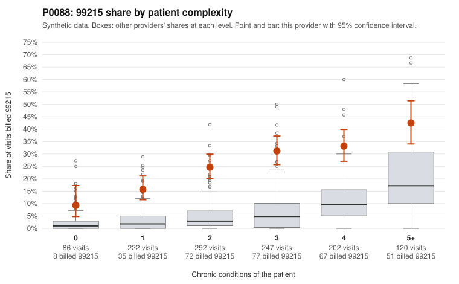

# P0088: P0088 (Family Practice, GA): elevated 99215 billing across every complexity tier, with 77% of documented 99215 claims unsupported, a pattern consistent with upcoding

**Leaning (advisory):** Pattern consistent with upcoding

## Why

P0088 billed 99215 on 26.5% of 1,169 claims, against an expected 5.7% given patient complexity (z=3.23 vs peers; risk-adjusted score 11.3). The excess is not confined to sicker patients. The provider's 99215 share is roughly 4-5x the all-provider rate for patients with 0-2 chronic conditions (9.3% vs 2.1%, 15.8% vs 3.4%, 24.7% vs 5.6%). It narrows only in the 5+ tier (42.5% vs 29.8%). The sampled low-complexity 99215 claims include single routine or symptom codes, such as Z09 follow-up (C0044545), R10.9 alone (C0044789, C0044898), M54.50 alone (C0044781, C0045451) and E78.5 alone (C0044783, C0045332). Documentation is reasonably deep (105 documented 99215 claims). Of these, 81 (77.1%) do not support the billed level, versus 24.2% across all providers. Examples include C0044626 and C0044716, which document moderate MDM and about 31-32 minutes. The 99214 unsupported rate is also elevated (23.4% vs 8.4%), while 99213 is near peer rates (8.5% vs 7.5%). Some 99215s are well supported (e.g., C0045134, C0045303: high MDM, 40+ minutes), and some high-complexity patients plausibly warrant 99215 (e.g., C0045426, C0045587). Overall the pattern is more consistent with upcoding than with a sicker panel. This is not a finding of fraud, and the records cover only about 30% of claims.

## Evidence chart

## Cited claims

`C0044545`, `C0044789`, `C0044898`, `C0044781`, `C0045451`, `C0044783`, `C0045332`, `C0044626`, `C0044716`, `C0045134`, `C0045303`, `C0045426`, `C0045587`

## Suggested next steps

- Pull full records for the sampled low-complexity 99215 claims (e.g., C0044545, C0044789, C0044898, C0045451) and verify MDM elements and total time.
- Expand documentation review on 99214 claims given the 23.4% unsupported rate, to gauge whether level inflation extends beyond 99215.
- Check whether time-based coding is being claimed for 99215 visits documented at about 30 minutes and moderate MDM.
- Compare problem-list conditions against claim diagnosis codes for high-complexity patients (e.g., C0044667 lists only I10) to confirm complexity is actually addressed at the visit.
- Review the provider's coding education and EHR templates or default level settings, and consider an extrapolated statistical sample audit.

---
Citations checked: 13/13 valid. Synthetic data. The leaning is advisory; the flag comes from the statistical screen, and no clinical documentation is available beyond the sampled records-review facts shown in the packet.
