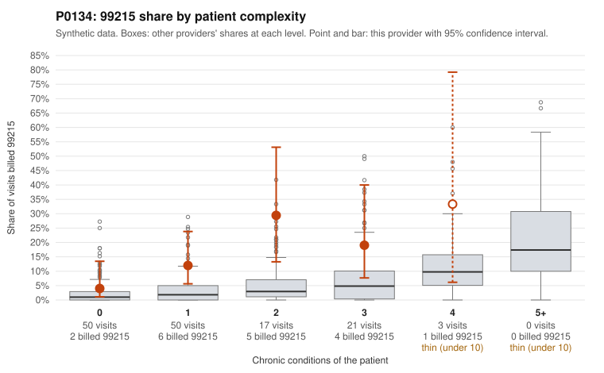

# P0134: P0134 (Family Practice, GA): 99215 share about 5x complexity-expected, but the 4 documented 99215s all support the billed level. Too few to judge.

**Leaning (advisory):** Inconclusive

## Why

P0134 billed 99215 on 12.8% of 141 claims, against about 2.5% expected for this patient mix. The risk-adjusted screen flagged the provider (score 2.85), though the raw peer z-score is modest (1.11). The 99215 share is above the all-provider rate in every complexity stratum, including low-complexity patients: 4% vs 2.1% at 0 chronic conditions and 12% vs 3.4% at 1 condition. The sample shows 99215s on patients with 0-1 conditions and simple diagnoses, such as Z09 follow-up (C0063715), UTI only (C0063820) and obesity/URI (C0063792). That is the concerning pattern. However, the records review cuts the other way. All 4 documented 99215 claims were supported (0% unsupported vs 24.2% for all providers), with high MDM and 40-47 minutes. Three of them were low-complexity patients (C0063715, C0063731, C0063785). The 22 documented 99214s were also all supported (0% vs 8.4%). The only unsupported example is a 99213 (C0063748), consistent with routine noise. Four documented 99215s is too thin to rule upcoding in or out. Pattern is mixed, so no conclusion yet.

## Evidence chart

## Cited claims

`C0063715`, `C0063820`, `C0063792`, `C0063731`, `C0063785`, `C0063779`, `C0063748`

## Suggested next steps

- Request records for more 99215 claims, prioritizing the undocumented low-complexity ones (C0063709, C0063768, C0063780, C0063792, C0063820), to get a meaningful unsupported-rate sample.
- For C0063715 (Z09 only, documented high MDM), verify the note substantiates high-complexity decision-making and is not templated or cloned.
- Compare documentation across the reviewed 99215 notes for copy-forward or identical time entries (e.g., 46 minutes recurring).
- Check whether the 1-condition panel's chronic-condition counts understate acuity (e.g., acute diagnoses, recent hospitalizations not captured in condition counts).
- Review same-patient repeat 99215s (P0134-N0050, two obesity-related visits) for medical necessity.

---
Citations checked: 7/7 valid. Synthetic data. The leaning is advisory; the flag comes from the statistical screen, and no clinical documentation is available beyond the sampled records-review facts shown in the packet.
