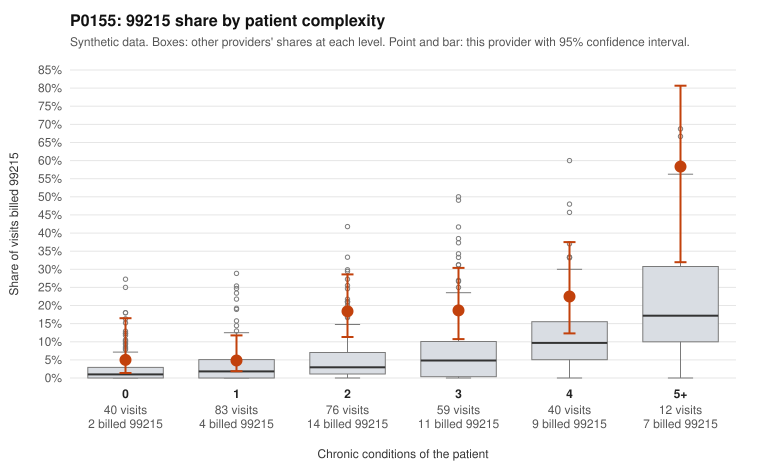

# P0155: P0155 (Family Practice, GA): 99215 share about 3.5x expected, but documented 99215 claims mostly support the billed level

**Leaning (advisory):** Pattern consistent with a high-acuity panel

## Why

P0155 billed 99215 on 15.2% of 310 claims against an expected 4.3% given patient complexity (risk-adjusted score 3.48; z vs peers 1.48). The excess appears in every complexity stratum. It is largest for patients with 2 conditions (18.4% vs 5.6%) and 3 conditions (18.6% vs 8.7%). There are also some 99215s on patients with 0 or 1 chronic conditions, such as C0071404 (low back pain, M54.50) and C0071411 (UTI, N39.0), which look discordant on claims data alone. However, the records review points away from upcoding. Of 16 documented 99215 claims, only 2 were unsupported (12.5%), about half the all-provider rate of 24.2%. Examples are C0071491 and C0071536, both documented as moderate MDM. Supported examples such as C0071623 (a 4-condition patient), C0071524 and C0071612 show high MDM with 45 to 51 minutes. The provider's unsupported rates for 99214 (8.7% vs 8.4%) and 99213 (3.8% vs 7.5%) are at or below peers. Overall, the pattern is consistent with a panel that is sicker than claims-based condition counts capture, rather than systematic upcoding. Two caveats apply. Sixteen documented 99215s is a modest sample. The packet also does not show whether any of the low-complexity 99215 claims were among those documented.

## Evidence chart

## Cited claims

`C0071404`, `C0071411`, `C0071412`, `C0071429`, `C0071579`, `C0071599`, `C0071623`, `C0071524`, `C0071612`, `C0071629`, `C0071491`, `C0071536`

## Suggested next steps

- Request records for the low-complexity 99215 claims (C0071404, C0071411, C0071412, C0071429, C0071579, C0071599) to see whether high MDM or 40+ minutes is documented.
- Expand the documentation sample for 99215s, since only 16 of 47 were reviewed, focusing on patients with 2 to 3 conditions where the excess over peers is largest.
- Check whether condition counts derived from claims understate acuity, for example missing diagnoses, recent hospitalizations or acute presentations, using the medical records.
- Review whether 99215s were billed on time or on MDM, and whether documented minutes are plausible against daily visit volume.
- Spot-check the 99214 'documented low MDM' claims (C0071400, C0071575, C0071591, C0071678), though their rate is in line with peers.

---
Citations checked: 12/12 valid. Synthetic data. The leaning is advisory; the flag comes from the statistical screen, and no clinical documentation is available beyond the sampled records-review facts shown in the packet.
