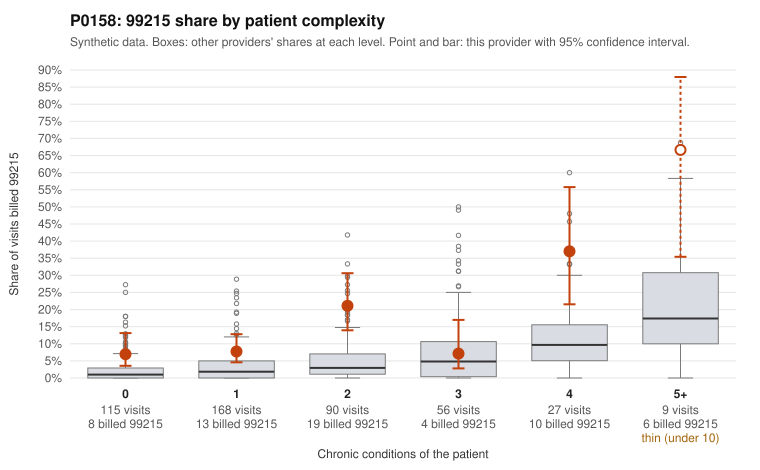

# P0158: P0158: 99215 share about 4x the complexity-adjusted expectation, but sampled documentation mostly supports the 99215s; 99214 support is weaker than peers

**Leaning (advisory):** Pattern consistent with a high-acuity panel

## Why

P0158 billed 99215 on 12.9% of 465 claims against an expected 3.0% given patient complexity (risk-adjusted score 4.53; z vs peers 1.13). The excess appears in most complexity strata, including low-complexity patients: 7.0% vs 2.1% at 0 conditions and 7.7% vs 3.4% at 1 condition. The sampled low-complexity 99215s include single-diagnosis visits such as rash (R21) with no chronic conditions (C0072150, C0072175, C0072182). On billing alone that is the concerning pattern. The records review points the other way for 99215: 4 of 20 documented 99215 claims (20%) did not support the billed level, below the all-provider rate of 24.2%. Several supported 99215s show high MDM at 45 to 52 minutes (C0072030, C0072047, C0072336), including one on a 1-condition patient (C0072282). This suggests these encounters may be more acute than chronic-condition counts capture. Unsupported 99215s do occur on low-complexity patients, where documentation showed moderate MDM at about 32 minutes (C0071949, C0072300; also C0072028). The weaker signal is at 99214: 11 of 79 unsupported (13.9% vs 8.4% for all providers), with examples documented as low MDM at 22 to 25 minutes (C0071941, C0071975, C0072316). Caveats: only 29% of claims have records and just 20 are documented 99215s, so the 99215 conclusion is tentative and could shift with more review.

## Evidence chart

## Cited claims

`C0072150`, `C0072175`, `C0072182`, `C0072030`, `C0072047`, `C0072336`, `C0072282`, `C0071949`, `C0072300`, `C0072028`, `C0071941`, `C0071975`, `C0072316`

## Suggested next steps

- Expand records review to the remaining undocumented 99215 claims, prioritizing low-complexity patients with single acute diagnoses (e.g., C0072150, C0072175, C0072182, C0071991, C0072226).
- Review a larger sample of 99214 claims, since the 13.9% unsupported rate is above the 8.4% peer rate and may indicate one-level upcoding at 99214 rather than 99215.
- For supported 99215s on low-complexity patients (e.g., C0072282), confirm what drove high MDM (acute problems, data reviewed, risk) to check that the documentation is not templated.
- Check whether the 2-condition and 4+ condition strata (21.1% and 37.0% vs 5.6% and 13.9% for peers) reflect specific patients with repeated 99215s (e.g., P0158-N0017 on C0071889 and C0072014).
- Compare time-based vs MDM-based level selection, since the unsupported 99215s cluster around 31 to 32 documented minutes.

---
Citations checked: 13/13 valid. Synthetic data. The leaning is advisory; the flag comes from the statistical screen, and no clinical documentation is available beyond the sampled records-review facts shown in the packet.
