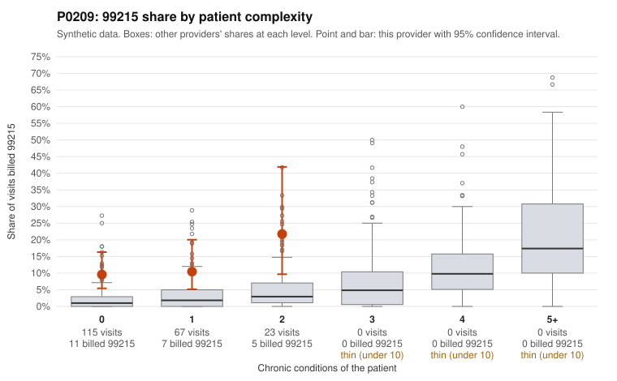

# P0209: P0209 (Family Practice, GA): 99215 share far above risk-adjusted expectation on a low-complexity panel, but only 3 documented 99215 claims, too thin to confirm or rule out upcoding

**Leaning (advisory):** Inconclusive

## Why

P0209 billed 99215 on 11.2% of 205 claims, against an expected 1.7% given patient complexity (risk-adjusted score 3.77). The unadjusted peer z is only 0.87, so the flag comes from the complexity adjustment. The panel is not complex. Every stratum reported is 0–2 chronic conditions, and the 4+ condition 99215 list is empty. Within each stratum the provider's 99215 rate runs about 3–5x the all-provider rate: 9.6% vs 2.1% at 0 conditions, 10.4% vs 3.4% at 1, and 21.7% vs 5.6% at 2. Sampled 99215s on 0-condition patients carry single routine diagnoses: URI (C0093991, C0094085), UTI (C0094003, C0094010), abdominal pain (C0094099 is not in packet; see C0093999, C0094095, C0094122) and rash (C0094074, C0094133). That billing pattern is consistent with upcoding. However, only 3 of the 23 billed 99215s have records. One is unsupported (C0094003: moderate MDM, 34 min), and two are supported at high MDM (C0094009 and C0094161, 45–46 min). A 33% unsupported rate on n=3 against a 24.2% all-provider rate cannot distinguish upcoding from documentation noise. Documented 99213 and 99214 claims show unsupported rates at or below peers (0% and 6.1%). The billing pattern is concerning, but the documentation is too thin to judge.

## Evidence chart

## Cited claims

`C0093991`, `C0094085`, `C0094003`, `C0094010`, `C0093999`, `C0094095`, `C0094122`, `C0094074`, `C0094133`, `C0094009`, `C0094161`

## Suggested next steps

- Request records for the remaining undocumented 99215 claims (20 of 23), prioritizing the 0-condition acute visits (URI, UTI, rash, abdominal pain), and compare documented MDM and minutes against 99215 requirements.
- Check whether the high-MDM documentation on C0094009 (29-year-old, UTI) is clinically plausible or reflects templated or inflated notes.
- Review repeat 99215 billing on the same low-complexity patients (P0209-N0088: C0093994, C0094094; P0209-N0079: C0094082, C0094096).
- Confirm the patient complexity data is complete, since the panel may carry conditions not captured in claims, and check whether the provider bills on time rather than MDM.
- Re-evaluate once at least 15–20 documented 99215 claims are available.

---
Citations checked: 11/11 valid. Synthetic data. The leaning is advisory; the flag comes from the statistical screen, and no clinical documentation is available beyond the sampled records-review facts shown in the packet.
