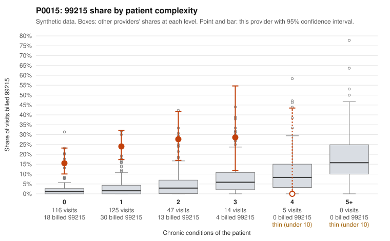

# P0015: P0015 (Family Practice, GA): 21% 99215 share vs ~2% expected for panel complexity; 18 of 22 documented 99215 claims unsupported, pattern consistent with upcoding

**Leaning (advisory):** Pattern consistent with upcoding

## Why

P0015 billed 65 of 307 claims as 99215 (21.2%), against an expected share of 2.0% given patient complexity (z vs peers 2.47, risk-adjusted score 9.11). The panel is mostly low complexity: 241 of 307 visits are for patients with 0-1 chronic conditions. Those visits carry 99215 shares of 15.5% and 24.0%, compared with 2.6% and 3.3% for all providers. On the 5 visits for patients with 4+ conditions, the provider billed no 99215s. Sampled 99215s on low-complexity patients include rash (R21; e.g., C0008615, C0008867), follow-up exams (Z09; e.g., C0008773, C0008846), URI (C0008783) and low back pain (C0008614). Documentation review is the strongest signal. 18 of 22 documented 99215 claims (81.8%) do not support the billed level, against a 26.9% all-provider rate. For example, C0008735 and C0008783 were documented at moderate MDM with 38 and 32 minutes. 99214 claims also run high (18% unsupported vs 8%; e.g., C0008908 documented as low MDM). Some 99215s are supported, notably the atrial fibrillation visits C0008756 and C0008824 (high MDM). This review is based on sampled claims and roughly a third of claims documented, so the findings are consistent with upcoding but do not establish it.

## Evidence chart

## Cited claims

`C0008615`, `C0008867`, `C0008773`, `C0008846`, `C0008783`, `C0008614`, `C0008735`, `C0008908`, `C0008756`, `C0008824`

## Suggested next steps

- Pull full records for the undocumented 99215 claims, prioritizing 0-1 condition patients with R21, Z09, J06.9 and M54.50 diagnoses, and verify MDM and time against 2021+ E/M guidelines.
- Expand documentation review of 99214 claims given the 18% unsupported rate (vs 8%).
- Check whether time-based billing (prolonged or total time) is being claimed, since unsupported 99215s show 32-39 documented minutes.
- Review templating/cloned-note patterns and EHR level-selection settings across the 99215 notes.
- Compare billing trends over 2024 and against peer Family Practice providers in GA before any recoupment or education decision.

---
Citations checked: 10/10 valid. Synthetic data. The leaning is advisory; the flag comes from the statistical screen, and no clinical documentation is available beyond the sampled records-review facts shown in the packet.
