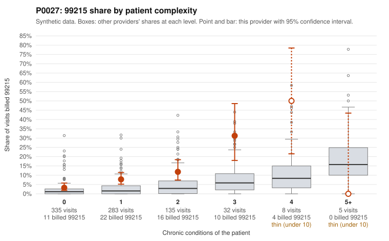

# P0027: P0027 (Family Practice, GA): 99215 share about 4x the complexity-adjusted expectation, but the documentation sample supports billed levels at or better than peer rates. On balance this leans toward a legitimately complex panel, with caveats.

**Leaning (advisory):** Pattern consistent with a high-acuity panel

## Why

P0027 billed 99215 on 7.9% of 798 claims, against 2.0% expected for its patient complexity (risk-adjusted score 4.45). Its raw peer z-score is only 0.42, so only the risk-adjusted screen flagged it. The 99215 share runs above the all-provider rate in every complexity stratum except 5+ (n=5). In the 0-1 condition strata the gap is 3.3% vs 2.6% and 7.8% vs 3.3%, and 33 of the 63 99215s fall there. The sampled low-complexity 99215s include simple-looking diagnoses such as rash (C0012254 is Z09 only; C0011854 is R21; C0011881 is R10.9), which is the concerning part of the pattern. However, the records review is the stronger discriminator, and it does not show upcoding. Of 20 documented 99215 claims, 4 (20%) were unsupported, below the 26.9% all-provider rate. The 99214 rate (5.7% vs 8.0%) and 99213 rate (2.9% vs 7.1%) are also below peers. Documented 99215s such as C0011749 and C0011889 show high MDM and 45-52 minutes. One unsupported 99215, C0012286 (0 chronic conditions, rash, documented moderate MDM, 35 min), is the low-complexity scenario of concern, but it is a single claim. Twenty documented 99215s is a modest base, so this is a pattern consistent with legitimately complex encounters rather than a firm conclusion. Chronic-condition counts may understate visit-level acuity.

## Evidence chart

## Cited claims

`C0012254`, `C0011854`, `C0011881`, `C0012286`, `C0011749`, `C0011889`, `C0011918`, `C0012297`, `C0012259`, `C0012445`

## Suggested next steps

- Expand records review to more 99215 claims, prioritizing those on patients with 0-1 chronic conditions (e.g., C0011854, C0012254, C0011881, C0012227), since only 20 of 63 99215s were documented.
- Check whether the documented 99215s that support high MDM are drawn mainly from complex patients or also include low-complexity patients; this would test whether chronic-condition counts understate acuity.
- Review the unsupported 99215s (C0012286, C0012259, C0012445) for a common pattern such as time-based billing below 99215 thresholds or template use.
- Check for acute-care or same-day complexity drivers (e.g., abdominal pain and UTI workups, ED diversion) that would justify high MDM in patients without chronic conditions.
- Confirm whether the risk-adjustment model's chronic-condition inputs are complete for this panel (e.g., missing diagnoses), since the raw peer z-score is unremarkable.

---
Citations checked: 10/10 valid. Synthetic data. The leaning is advisory; the flag comes from the statistical screen, and no clinical documentation is available beyond the sampled records-review facts shown in the packet.
