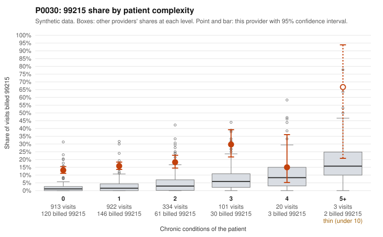

# P0030: P0030 (Family Practice, GA): 99215 share of 15.8% vs 1.95% expected for its patient mix, with 78% of documented 99215 claims unsupported by the records

**Leaning (advisory):** Pattern consistent with upcoding

## Why

P0030 billed 99215 on 15.8% of 2,293 claims. The expected share given its patients' complexity is 1.95%. Most visits are on low-complexity patients: 913 visits with 0 chronic conditions and 922 with 1. On those visits the 99215 share is 13.1% and 15.8%, against 2.6% and 3.3% for all providers. Sampled examples include 99215s for a 0-condition patient with upper respiratory infection (C0014756, C0013547), rash (C0013428, C0013990), back pain (C0014662) and follow-up visits (C0013852, C0014826). The records review is substantial: 115 documented 99215 claims. Of these, 90 (78.3%) were not supported by the documentation, versus 26.9% for all providers. Examples include C0013063 (low MDM, 26 min) and C0013300 (moderate MDM, 38 min). 99214 is also elevated, at 25.9% unsupported vs 8.0% for all providers (e.g., C0013925, straightforward MDM, 14 min). Some 99215s do appear legitimate, such as C0013554, a 4-condition patient with high MDM and 42 min. Taken together, the pattern is consistent with upcoding rather than a sicker panel. This is not a fraud finding, and the claim lists are random samples.

## Evidence chart

## Cited claims

`C0014756`, `C0013547`, `C0013428`, `C0013990`, `C0014662`, `C0013852`, `C0014826`, `C0013063`, `C0013300`, `C0013925`, `C0013554`

## Suggested next steps

- Pull full medical records for the sampled low-complexity 99215 claims (e.g., C0014756, C0013428, C0013852) and score MDM and time independently.
- Have a certified coder re-review a fresh random sample of documented 99215 and 99214 claims to confirm the 78% and 26% unsupported rates.
- Check whether the documentation uses templated or cloned notes, or time attestations that don't match the visit content.
- Review payment trends over 2024 and compare against prior years to see when the shift toward 99214 and 99215 began.
- Consider provider education or a prepayment review for 99215, and estimate the overpayment from the unsupported rates if confirmed.

---
Citations checked: 11/11 valid. Synthetic data. The leaning is advisory; the flag comes from the statistical screen, and no clinical documentation is available beyond the sampled records-review facts shown in the packet.
