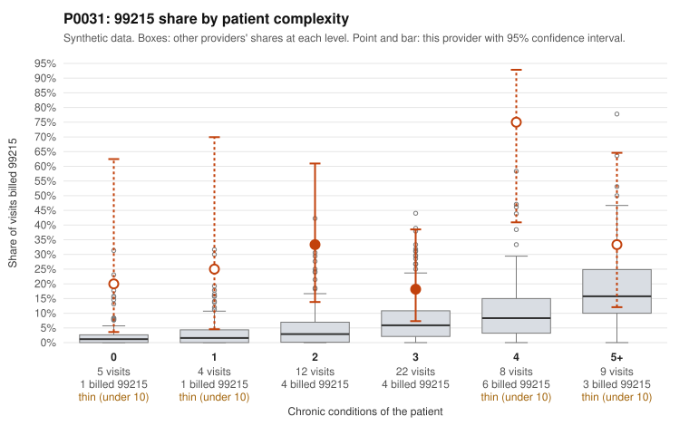

# P0031: P0031: 99215 share ~5x expected and elevated in every complexity stratum, but the few documented 99215s are supported; documentation too thin to decide

**Leaning (advisory):** Inconclusive

## Why

P0031 billed 99215 on 19 of 60 claims (31.7%), against 6.1% expected for this panel's complexity (z = 4.1, risk-adjusted score 3.12). A sicker panel does not explain the excess, because the share is elevated in every chronic-condition stratum. It is 20% and 25% for patients with 0 and 1 conditions (peers 2.6% and 3.3%) and 75% for patients with 4 conditions (peers 10.4%). Two sampled low-complexity 99215s look questionable on their face. C0015161 is a 46-year-old with hyperlipidemia and an upper respiratory diagnosis (J06.9). C0015192 is an 18-year-old with no chronic conditions and a UTI (N39.0); the same patient's earlier UTI visit, C0015169, was billed 99214. The records review points the other way. All 19 documented claims supported the billed level, including all 14 billed 99214. The 3 documented 99215s (C0015164, C0015187, C0015203) each showed high MDM and 41-54 minutes, versus a 26.9% unsupported rate across all providers. Three documented 99215s out of 19 billed is too few to judge the 99215 pattern either way. The billing pattern is consistent with possible upcoding, but the limited documentation so far is consistent with legitimate complexity.

## Evidence chart

## Cited claims

`C0015161`, `C0015192`, `C0015169`, `C0015164`, `C0015187`, `C0015203`, `C0015215`

## Suggested next steps

- Request records for the remaining 16 undocumented 99215 claims, prioritizing the low-complexity ones (C0015161, C0015192) and any other 99215s on patients with 0-2 chronic conditions.
- For C0015192 vs C0015169, compare documentation for the same patient and diagnosis to see why the levels differ.
- Sample additional 99214 claims on low-complexity patients (e.g., C0015215, obesity only) to confirm the clean 99214 documentation result holds.
- Check whether 99215s are billed on time rather than MDM, and whether the documented minutes are plausible against daily visit volume.
- Review whether the 4-condition stratum (6 of 8 visits at 99215) is driven by a few repeat patients, such as P0031-N0008 and P0031-N0020.

---
Citations checked: 7/7 valid. Synthetic data. The leaning is advisory; the flag comes from the statistical screen, and no clinical documentation is available beyond the sampled records-review facts shown in the packet.
