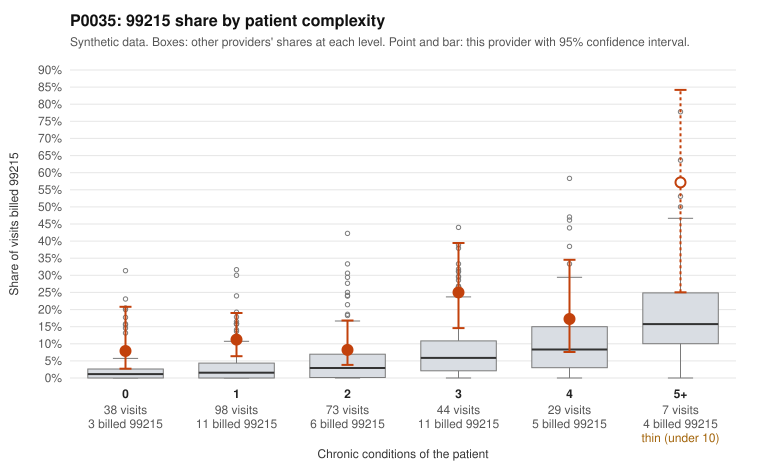

# P0035: P0035 (Family Practice, GA): 99215 share about 4x the risk-adjusted expectation, but all 12 documented 99215 claims support the billed level; leaning toward legitimate complexity, with open questions on low-complexity 99215s and lower-level coding

**Leaning (advisory):** Pattern consistent with a high-acuity panel

## Why

P0035 billed 99215 on 13.8% of 289 claims, against 3.5% expected given patient chronic-condition mix (risk-adjusted score 3.62). The excess appears in every complexity stratum, including patients with 0 conditions (7.9% vs 2.6% all-provider) and 1 condition (11.2% vs 3.3%). The low-complexity sample includes 99215s for single, often stable diagnoses, such as hyperlipidemia-only visits (C0017922, C0017967, C0017988) and a Z09 follow-up (C0017983). On claims alone, that would be the concern. However, records review found 0 of 12 documented 99215 claims unsupported, versus a 26.9% all-provider rate. At the peer rate, roughly 3 of 12 would be expected to fail. Supported examples document high MDM and 44-48 minutes, including high-complexity patients (C0018003, C0018039) and others (C0018078, C0018096). This is consistent with genuinely complex encounters that chronic-condition counts do not capture. Caveats: 12 documented 99215s is a modest sample, and the packet does not show whether any of them were on 0-1 condition patients. Separately, unsupported rates are elevated at lower levels: 99214 at 11.9% vs 8.0% (8 of 67), and 99213 at 21.4% vs 7.1% (3 of 14, small n). Examples include 99214s documented as low MDM at 20-26 minutes (C0018080, C0018117). This is a modest signal worth watching, given that 99214 makes up about 73% of volume.

## Evidence chart

## Cited claims

`C0017922`, `C0017967`, `C0017988`, `C0017983`, `C0018003`, `C0018039`, `C0018078`, `C0018096`, `C0018082`, `C0018117`

## Suggested next steps

- Pull records for the 99215 claims on 0-1 condition patients (e.g., C0017922, C0017967, C0017983, C0018112, C0018125) and check whether documentation supports high MDM or 40+ minutes on those visits specifically.
- Confirm how many of the 12 documented 99215 claims fall in the low-complexity strata; if none do, the clean documentation result may not extend to the concerning subgroup.
- Expand the documentation sample for 99214 claims, the dominant code (211 claims), to test whether the 11.9% unsupported rate reflects a systematic one-level upcode or noise.
- Review time-based billing support (total time attestations, prolonged-service or care-coordination notes) since documented 99215 minutes cluster at 44-48.
- Check whether the panel has acuity not captured by chronic-condition counts (recent hospital discharges, acute presentations, social complexity) that would explain the elevated share across all strata.

---
Citations checked: 10/10 valid. Synthetic data. The leaning is advisory; the flag comes from the statistical screen, and no clinical documentation is available beyond the sampled records-review facts shown in the packet.
