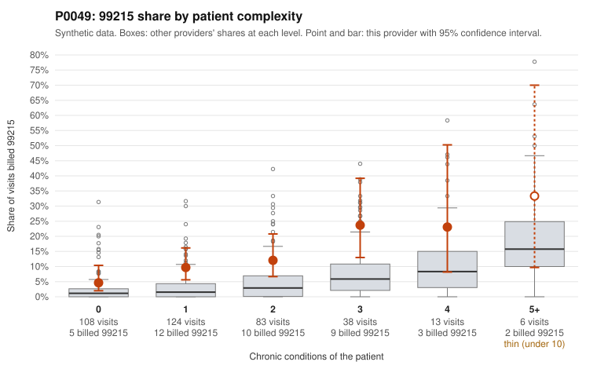

# P0049: P0049 (Family Practice, GA): 99215 share is about 4x the complexity-adjusted expectation, but every documented 99215 in the sample supports the billed level

**Leaning (advisory):** Pattern consistent with a high-acuity panel

## Why

P0049 billed 99215 on 11.0% of 372 claims, against 2.6% expected for this panel's complexity (risk-adjusted score 3.81; peer z only 0.90). The excess appears at every complexity level, including patients with 0 chronic conditions (4.6% vs 2.6%) and 1 condition (9.7% vs 3.3%). The sampled low-complexity 99215s include visits with single, simple diagnoses, such as C0023696 (Z09 follow-up) and C0023989 (R10.9, age 18). On claims data alone, that would raise concern. However, the records review points the other way. None of the 11 documented 99215 claims was unsupported (0.0%), versus 26.9% across all providers, and about 3 would be expected at that rate. The supported examples include low-complexity patients: C0023744 (hypertension only; high MDM, 45 min) and C0023935 (hyperlipidemia; high MDM, 42 min). They also include complex patients: C0023679 (high MDM, 48 min) and C0023870 (high MDM, 51 min). Unsupported rates at 99214 (3.0% vs 8.0%) and 99213 (6.2% vs 7.1%) are also at or below peer rates. Isolated mismatches such as C0023814 and C0024012 (99214 billed, low MDM documented) are within expected noise. Overall the pattern is consistent with genuinely complex visits that chronic-condition counts do not capture, rather than upcoding. Caveats: only 11 of 41 99215s (about 27%) have documentation, so the evidence is moderate rather than conclusive, and documentation may be inflated alongside billing.

## Evidence chart

## Cited claims

`C0023696`, `C0023989`, `C0023744`, `C0023935`, `C0023679`, `C0023870`, `C0023814`, `C0024012`

## Suggested next steps

- Pull records for the remaining undocumented 99215 claims, prioritizing the 0-condition visits (e.g., C0023696, C0023989, C0023783, C0023821, C0023873), to test whether support holds where claims-based complexity is lowest.
- For the documented 99215s, check whether the high MDM is substantiated by specific elements (data reviewed, risk of management, acute problems) rather than templated or cloned note language.
- Check whether documented minutes are internally consistent with the visit content and with same-day scheduling volume.
- Review the 99214-heavy mix (238/372 claims), including 99214s on 0–1 condition patients (e.g., C0023712), as a secondary check, although the 99214 unsupported rate is below peers.
- If expanded records continue to support the billed levels, consider closing or deprioritizing the case and noting that chronic-condition counts underestimate this panel's acuity.

---
Citations checked: 8/8 valid. Synthetic data. The leaning is advisory; the flag comes from the statistical screen, and no clinical documentation is available beyond the sampled records-review facts shown in the packet.
