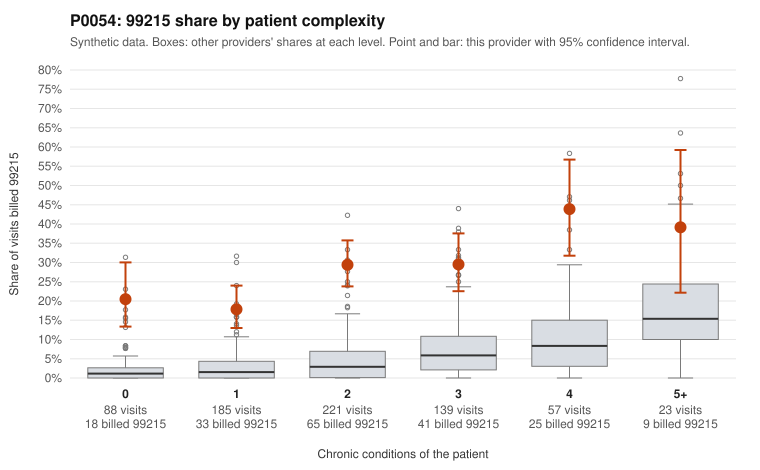

# P0054: P0054 (Family Practice, GA): 99215 share 26.8% vs 3.6% expected, elevated in every complexity band, with 63 of 71 documented 99215s (88.7%) unsupported

**Leaning (advisory):** Pattern consistent with upcoding

## Why

P0054 billed 99215 on 26.8% of 713 claims, against 3.6% expected for this panel's complexity (z=3.34 vs peers; risk-adjusted score 12.75). The excess is not limited to sick patients. 99215 share is 20.5% for patients with 0 chronic conditions (all-provider 2.6%) and 17.8% for those with 1 (3.3%). It also runs 3-6x peers in the 2-4 condition bands. Sampled low-complexity 99215s include routine-appearing diagnoses such as URI (J06.9, C0025271, C0025626), follow-up exams (Z09, C0025309, C0025527) and back pain (M54.50, C0025501). Documentation is the strongest signal. Of 71 documented 99215 claims, 63 (88.7%) did not support the billed level, versus 26.9% across all providers. Documented 99214s were also unsupported at 19.7% vs 8.0%. Two sampled low-complexity 99215s (C0025593, C0025676) were documented at only moderate MDM with 39 minutes. Some 99215s on complex patients are supported, for example C0025712 (5 conditions, high MDM, 51 minutes), so not every high-level claim is suspect. Records cover only 32% of claims, and this is a pattern finding, not a fraud determination.

## Evidence chart

## Cited claims

`C0025271`, `C0025626`, `C0025309`, `C0025527`, `C0025501`, `C0025593`, `C0025676`, `C0025326`, `C0025578`, `C0025712`, `C0025537`, `C0025511`, `C0025790`

## Suggested next steps

- Pull full records for sampled 99215s on 0-1 condition patients (e.g., C0025271, C0025309, C0025501, C0025626) and confirm the MDM elements and total time.
- Review the 63 unsupported documented 99215s to see whether the shortfall is systematic, such as moderate MDM with 30-39 minutes billed as 99215.
- Assess the 99214 unsupported rate (19.7%) for possible one-level upcoding at that level too.
- Check for templated or cloned notes and time attestations across visits.
- Compare billing trends over 2024 and against same-practice peers to rule out a legitimately distinct panel or coding-staff error.
- Consider provider education or a targeted prepayment review, depending on what the record findings show.

---
Citations checked: 13/13 valid. Synthetic data. The leaning is advisory; the flag comes from the statistical screen, and no clinical documentation is available beyond the sampled records-review facts shown in the packet.
