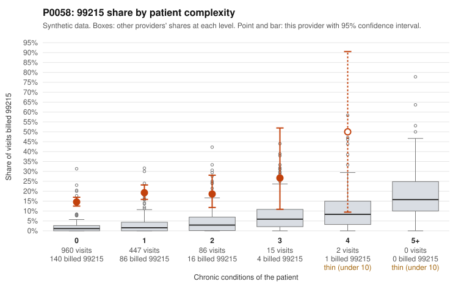

# P0058: P0058 (Family Practice, GA): 16.4% 99215 share on a mostly low-complexity panel, with 81% of documented 99215s unsupported. Pattern consistent with upcoding.

**Leaning (advisory):** Pattern consistent with upcoding

## Why

P0058 billed 247 of 1,510 claims (16.4%) as 99215, against an expected 1.5% given patient complexity (risk-adjusted score 17.9). The panel is not unusually sick. 1,407 of 1,510 visits were for patients with 0 or 1 chronic conditions, and the provider's 99215 share there was 14.6% and 19.2%, versus 2.6% and 3.3% for all providers. The sampled low-complexity 99215s involve routine problems such as URI (J06.9, C0027017, C0027968), follow-up (Z09, C0027149, C0027292), UTI (N39.0, C0027276, C0027829) and uncomplicated diabetes or hypertension (E11.9/I10, C0027578, C0028000). In the comparison sample, the same patient with the same back-pain diagnosis (M54.50) was billed 99213 in February (C0027084) and 99215 in March (C0027246). The records review is substantial: 75 documented 99215 claims, of which 61 (81.3%) did not support the billed level, against a 26.9% all-provider rate. Examples include C0027347 and C0028192, both documented as moderate MDM at roughly 31-34 minutes. The 99214 unsupported rate is also elevated (21.9% vs 8.0%, e.g., C0027230). A minority of 99215s are well supported (C0027101, C0027781: high MDM, 50+ minutes), so not every high-level claim is suspect. Records cover only 29% of claims and documentation is noisy, but this volume of documented mismatches is well beyond what noise would explain. This is a pattern for review, not a finding of fraud.

## Evidence chart

## Cited claims

`C0027017`, `C0027968`, `C0027149`, `C0027292`, `C0027276`, `C0027829`, `C0027578`, `C0028000`, `C0027084`, `C0027246`, `C0027347`, `C0028192`, `C0027230`, `C0027101`, `C0027781`

## Suggested next steps

- Pull full records for a fresh random sample of undocumented 99215 claims, prioritizing patients with 0-1 chronic conditions, and score MDM and time under 2021 E/M guidelines.
- Review the 99214 claims, since the 21.9% unsupported rate suggests level inflation may extend beyond 99215.
- Compare same-patient, same-diagnosis visits billed at different levels (e.g., patient P0058-N0541) to look for inconsistent coding.
- Check whether time-based billing is being claimed without documented minutes, and whether templated or cloned notes are inflating MDM.
- Identify who performs coding (provider, coder, or EHR default) and look for a change point in the 99215 share over 2024.
- Quantify the overpayment from the documented-claim unsupported rates and consider extrapolation via a statistically valid sample before any referral.

---
Citations checked: 15/15 valid. Synthetic data. The leaning is advisory; the flag comes from the statistical screen, and no clinical documentation is available beyond the sampled records-review facts shown in the packet.
