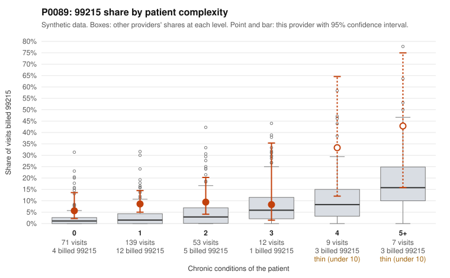

# P0089: P0089 (Family Practice, GA): 99215 share is about 4x what patient complexity predicts, but every documented 99215 in the sample supports the billed level. The pattern leans toward legitimate acuity, with a secondary 99214 signal worth checking.

**Leaning (advisory):** Pattern consistent with a high-acuity panel

## Why

P0089 billed 99215 on 9.6% of 291 claims, against 2.4% expected from patient complexity. The flag came from the risk-adjusted screen (score 2.96); the unadjusted peer z-score is unremarkable (0.69). The excess appears at every complexity level, including low-complexity patients: 0 conditions 5.6% vs 2.6% for all providers, 1 condition 8.6% vs 3.3%. The sampled low-complexity 99215s include single or symptom-only diagnoses (e.g., C0036725 R10.9, C0036902 R21, C0036922 E78.5), which on claims alone would raise concern. The documentation review points the other way. Of 9 documented 99215 claims, 0 were unsupported, versus a 26.9% all-provider unsupported rate. Two of the supported ones are on 1-condition patients: C0036851 (high MDM, 45 min) and C0036941 (high MDM, 41 min). This suggests chronic-condition counts may understate visit complexity for this panel. Nine documented claims is a small base, so this is suggestive rather than conclusive. Separately, documented 99214s are unsupported at 14.3% (6/42) versus 8.0% for all providers (e.g., C0036734, C0036756, C0036819, all low MDM, 21-27 min). That is a modest, small-sample signal of possible one-level upcoding at 99214 rather than 99215. Nothing here asserts fraud.

## Evidence chart

## Cited claims

`C0036725`, `C0036902`, `C0036922`, `C0036851`, `C0036941`, `C0036951`, `C0037009`, `C0036734`, `C0036756`, `C0036819`, `C0036828`, `C0036971`, `C0036978`

## Suggested next steps

- Pull records for the remaining undocumented 99215 claims, prioritizing those on 0-condition patients (C0036725, C0036899, C0036902, C0036940), to see whether the 0/9 unsupported rate holds.
- Expand the 99214 documentation sample to test whether the 14.3% unsupported rate is real or noise; 99214 is 192 of 291 claims and drives most of the billing volume.
- Check whether low-complexity 99215 visits are justified by time (prolonged counseling) or by acute problems not captured in chronic-condition counts.
- Review repeat 99215s on the same low-complexity patients (P0089-N0121, P0089-N0003, P0089-N0076) for templated or cloned documentation.
- Compare the payment impact of any confirmed 99214-to-99213 downcoding against the 99215 excess to set investigative priority.

---
Citations checked: 13/13 valid. Synthetic data. The leaning is advisory; the flag comes from the statistical screen, and no clinical documentation is available beyond the sampled records-review facts shown in the packet.
