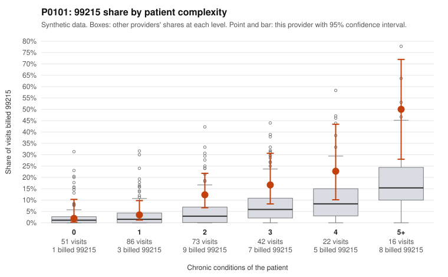

# P0101: P0101 (Family Practice, GA): 99215 excess sits in sicker patients and the few documented 99215s are supported. This leans toward a complex panel, but 99215 documentation is thin.

**Leaning (advisory):** Pattern consistent with a high-acuity panel

## Why

P0101 billed 99215 on 11.4% of 290 claims, against 3.5% expected for this patient mix. The excess is concentrated in complex patients. For patients with 0–1 chronic conditions, the 99215 share (2.0%, 3.5%) is about the same as all providers (2.6%, 3.3%). For patients with 2 or more conditions it is roughly double the peer rate, reaching 50% vs 22.4% at 5+ conditions. Sampled high-complexity 99215s involve multimorbid, often elderly patients, such as C0041527 (CKD, diabetes, AFib) and C0041703 (heart failure, AFib). The four sampled low-complexity 99215s are worth a look because they carry thin diagnoses: C0041746 (rash, R21) and C0041792 (hyperlipidemia only), plus C0041568 and C0041619. In the documentation review, 0 of 6 documented 99215s were unsupported, against 26.9% for all providers, and all four example records show high MDM at 42–46 minutes (C0041574, C0041706, C0041735, C0041782). That supports a legitimately complex panel, but 6 records is too few to rule out upcoding. Separately, unsupported rates are modestly above peers for 99214 (12.8% vs 8.0%, n=47) and 99213 (12% vs 7.1%, n=25), for example C0041526, C0041590 and C0041603. 99214 is the dominant code at 166 of 290 claims. Overall the pattern is consistent with a sicker panel billed somewhat more intensively than peers, rather than clear 99215 upcoding.

## Evidence chart

## Cited claims

`C0041527`, `C0041703`, `C0041568`, `C0041619`, `C0041746`, `C0041792`, `C0041574`, `C0041706`, `C0041735`, `C0041782`, `C0041526`, `C0041590`, `C0041603`

## Suggested next steps

- Request records for more 99215 claims to firm up the 0/6 unsupported finding, starting with the low-complexity ones (C0041568, C0041619, C0041746, C0041792).
- Expand the 99214 documentation sample, since it makes up 57% of volume and its unsupported rate (12.8%) is above peers; prioritize 99214s on 0-condition patients such as C0041601 and C0041696.
- Check whether visit diagnosis codes reflect the conditions actually managed; several complex-patient 99215s list a single diagnosis (e.g., C0041703 F32.9 only, C0041653 E66.9 only).
- Compare P0101's 99215 share within each complexity tier against same-specialty GA peers to see whether the roughly 2x excess in multimorbid patients is unusual for family practice.

---
Citations checked: 13/13 valid. Synthetic data. The leaning is advisory; the flag comes from the statistical screen, and no clinical documentation is available beyond the sampled records-review facts shown in the packet.
