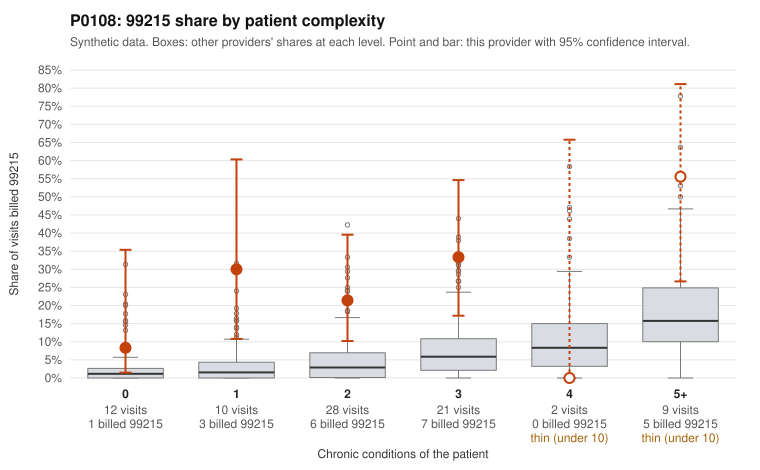

# P0108: P0108 (Family Practice, GA): 99215 share far above expectation, but every documented 99215 supports the billed level. Leans toward a legitimately complex panel, with open questions.

**Leaning (advisory):** Pattern consistent with a high-acuity panel

## Why

P0108 billed 99215 on 22 of 82 claims (26.8%), against an expected 4.4% given patient complexity (z = 3.35, risk-adjusted score 3.76). The 99215 share is elevated in every complexity stratum, including patients with 0 or 1 chronic conditions (4 of 22 visits). Sampled examples include C0043766 (no chronic conditions, rash diagnosis R21) and C0043827 (hypothyroidism only). That is the part of the pattern most consistent with upcoding. However, the records review cuts the other way. All 6 documented 99215 claims supported the billed level (0% unsupported vs 26.9% across all providers), as did all 12 documented 99214 claims. Examples include C0043764, C0043772, C0043777 and C0043797, each documented as high MDM with 43 to 53 minutes. On balance the documentation is more consistent with a complex panel than with upcoding. Two caveats apply. Six documented 99215s is a modest sample. None of the sampled low-complexity 99215s are shown as documented. One item needs a check: patient P0108-N0026 has both a 99215 (C0043798) and a 99214 (C0043806) on 2024-04-02.

## Evidence chart

## Cited claims

`C0043766`, `C0043790`, `C0043798`, `C0043827`, `C0043806`, `C0043764`, `C0043772`, `C0043777`, `C0043797`, `C0043756`, `C0043794`, `C0043810`

## Suggested next steps

- Pull records for the 99215 claims on low-complexity patients (C0043766, C0043790, C0043798, C0043827) to see whether high MDM or 40+ minutes is documented.
- Review the same-day 99215/99214 pair for patient P0108-N0026 on 2024-04-02 (C0043798, C0043806) for possible duplicate or split billing.
- Check the frequency of 99215 visits for patient P0108-N0009 (C0043756, C0043810, C0043777, C0043794, including two 99215s 11 days apart in December 2024) against clinical need.
- Expand the documentation sample beyond 6 of 22 99215 claims, stratified by patient complexity, to firm up the 0% unsupported finding.
- Confirm whether chronic-condition counts undercount acuity for this panel, for example acute problems or diagnoses not captured in the condition list.

---
Citations checked: 12/12 valid. Synthetic data. The leaning is advisory; the flag comes from the statistical screen, and no clinical documentation is available beyond the sampled records-review facts shown in the packet.
