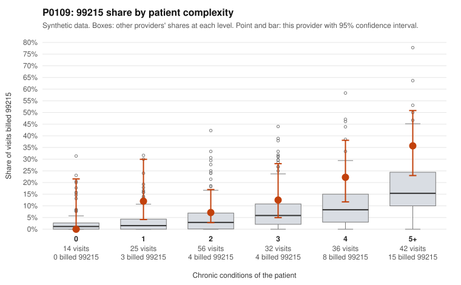

# P0109: P0109 (Family Practice, GA): 99215 share is about 2.7x the complexity-adjusted expectation, but the 99215s cluster on complex patients and all 13 documented 99215s are supported. The pattern leans toward a sicker panel, with a secondary 99214 question.

**Leaning (advisory):** Pattern consistent with a high-acuity panel

## Why

P0109 billed 34 of 205 claims (16.6%) as 99215, against 6.2% expected for its patient mix. Of those 34, 23 fall on patients with 4+ chronic conditions (8 of 36 visits and 15 of 42 visits), and none on patients with 0 conditions. The provider's 99215 share does exceed the all-provider share in every complexity stratum. Records review is the strongest signal. All 13 documented 99215 claims were supported (0% unsupported vs 26.9% across providers), with high MDM and 41-54 minutes (e.g., C0043896, C0043923, C0043960, C0043969). That is consistent with legitimately complex visits rather than 99215 upcoding. Two residual concerns remain. First, 3 of 25 visits by 1-condition patients were billed 99215 (12% vs 3.3%), and none of these three is in the documented examples. C0043907 is a 30-year-old with osteoarthritis and back pain, a patient later billed 99213 (C0043897). C0043854 and C0043882 also lack documentation in the packet. Second, 99214 is 70% of billing, and 4 of 31 documented 99214s were unsupported (12.9% vs 8%). Each of those (C0043852, C0043908, C0043993, C0044017) shows low MDM and 23-29 minutes. That difference rests on small counts and is only suggestive. Records cover 24% of claims, and the claim lists are samples.

## Evidence chart

## Cited claims

`C0043896`, `C0043923`, `C0043960`, `C0043969`, `C0043854`, `C0043882`, `C0043907`, `C0043897`, `C0043852`, `C0043908`, `C0043993`, `C0044017`

## Suggested next steps

- Pull records for the low-complexity 99215 claims (C0043854, C0043882, C0043907) to check whether acute problems justified high MDM. C0043882 carries a UTI code (N39.0) in addition to asthma.
- Expand the 99214 documentation sample to see whether the elevated unsupported rate (4/31) holds up with more claims, given that 99214 dominates this provider's billing.
- Compare the provider's 99214 share within each complexity stratum to peers; this stratified breakdown is not in the packet.
- Confirm that chronic-condition counts reflect active, managed conditions at each visit rather than problem-list carryover.
- Unless further review changes the picture, treat the 99215 flag as likely explained by panel acuity and documentation, and deprioritize the 99215 concern.

---
Citations checked: 12/12 valid. Synthetic data. The leaning is advisory; the flag comes from the statistical screen, and no clinical documentation is available beyond the sampled records-review facts shown in the packet.
