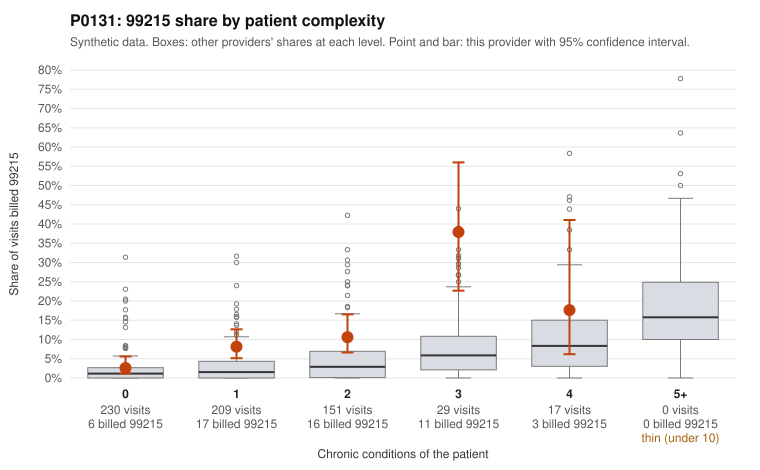

# P0131: P0131: 99215 share well above the risk-adjusted expectation, but the documented 99215 claims mostly support the billed level

**Leaning (advisory):** Pattern consistent with a high-acuity panel

## Why

P0131 billed 99215 on 8.3% of 636 claims against a complexity-adjusted expectation of 2.2%. It was flagged on the risk-adjusted score (3.99), while its raw z versus peers is only 0.49. The excess sits inside complexity strata rather than in a sicker mix. At 0 chronic conditions the 99215 share matches peers (2.6%), but it is 8.1% vs 3.3% at 1 condition, 10.6% vs 4.8% at 2, and 37.9% vs 7.7% at 3 (29 visits). The sampled low-complexity 99215s include brief-looking encounters such as follow-up only (C0055681, Z09), back pain (C0055714, C0056106) and rash (C0055775), none of which appear in the documentation examples. The records review cuts the other way. Only 2 of 13 documented 99215s (15.4%) were unsupported, below the all-provider rate of 26.9%: C0055847 and C0055914, both documented at moderate MDM. Four sampled 99215s were documented at high MDM with 42-53 minutes (C0055782, C0055980, C0056006, C0056209). The 99214 unsupported rate (4.6%) is also below peers (8.0%). This leans toward encounters that are genuinely more complex than chronic-condition counts capture. However, 13 documented 99215s is a modest base, and the low-complexity 99215s specifically are not shown to be reviewed, so the lean is tentative and not a clearance.

## Evidence chart

## Cited claims

`C0055681`, `C0055714`, `C0056106`, `C0055775`, `C0055847`, `C0055914`, `C0055782`, `C0055980`, `C0056006`, `C0056209`

## Suggested next steps

- Pull records for the sampled 99215 claims on 0-1 condition patients (e.g., C0055681, C0055714, C0055775, C0056106, C0055785) to test whether documentation supports high MDM or 40+ minutes on these encounters specifically.
- Expand the documentation sample for 99215 beyond 13 claims so the unsupported rate can be estimated with more confidence.
- Review the 3-condition stratum (11 of 29 visits billed 99215) to see whether those encounters reflect acute exacerbations or other acuity not captured by condition counts.
- Check whether 99215s on low-complexity patients were billed on time rather than MDM, and whether documented minutes meet the threshold.
- Look for repeat 99215 billing on the same low-complexity patient (e.g., P0131-N0114 on C0055753 and C0056221) and any template or cloned-note patterns.

---
Citations checked: 10/10 valid. Synthetic data. The leaning is advisory; the flag comes from the statistical screen, and no clinical documentation is available beyond the sampled records-review facts shown in the packet.
