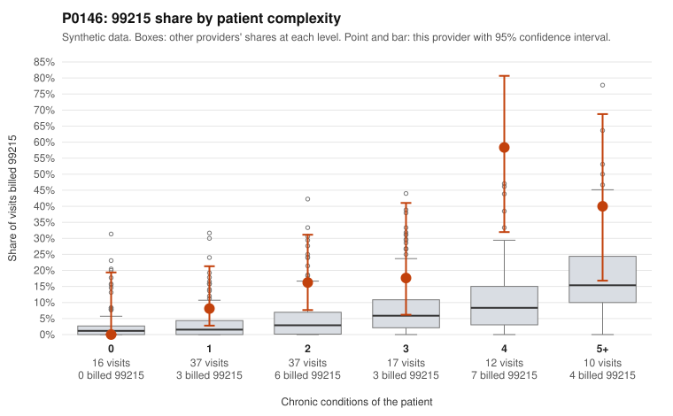

# P0146: P0146 (Family Practice, GA): 99215 share is elevated and tracks patient complexity, and all 5 documented 99215s are supported. Tentatively consistent with a higher-acuity panel, but the documentation sample is thin.

**Leaning (advisory):** Pattern consistent with a high-acuity panel

## Why

P0146 billed 99215 on 17.8% of 129 claims, against 3.9% expected given patient complexity (risk-adjusted score 3.06, z 1.96). The 99215 share rises with complexity: 0% on 0-condition patients, 8.1% on 1 condition, 16.2% on 2, 17.6% on 3, 58.3% on 4, and 40% on 5+. However, it is above the all-provider rate in every stratum with any 99215s, so complexity counts alone do not explain the excess. Records review found 0 of 5 documented 99215 claims unsupported, against a 26.9% all-provider rate. The supported examples show high MDM and 44–54 minutes (C0060612, C0060673, C0060680, C0060682). The 99214 unsupported rate (2 of 23, 8.7%) is in line with peers (8.0%). The 99213 rate is 1 of 7 (14.3%) vs 7.1%, too few claims to read much into. Concerns remain:
- Three sampled 99215s are on single-condition patients, including two for a 55-year-old with hypertension only (C0060651, C0060676) and one for a CKD patient (C0060587).
- Some high-complexity 99215s list a single, minor diagnosis code (C0060662: E03.9 only; C0060675: E66.9 only).
Only 5 of 23 99215 claims are documented, so finding zero unsupported is encouraging but not conclusive. This is a cautious lean, not a clearance.

## Evidence chart

## Cited claims

`C0060612`, `C0060673`, `C0060680`, `C0060682`, `C0060651`, `C0060676`, `C0060587`, `C0060662`, `C0060675`

## Suggested next steps

- Request records for additional 99215 claims (ideally all 23), prioritizing the low-complexity ones C0060587, C0060651, and C0060676, to see if the 0% unsupported rate holds.
- Review the high-complexity 99215s that list a single or minor diagnosis code (C0060662, C0060675, C0060574) to confirm the MDM addressed multiple conditions.
- Check acuity markers beyond chronic condition counts (hospitalizations, ED visits, medication burden, recent discharges) to see whether they explain 99215 shares above peers within each complexity stratum.
- Assess whether the 99215 pattern is concentrated in a few patients (e.g., P0146-N0022, P0146-N0036, and P0146-N0055 each appear twice) and whether visit frequency is clinically justified.
- Treat the 99213 unsupported rate (1 of 7) as unresolved pending a larger documented sample; it is too small to judge.

---
Citations checked: 9/9 valid. Synthetic data. The leaning is advisory; the flag comes from the statistical screen, and no clinical documentation is available beyond the sampled records-review facts shown in the packet.
