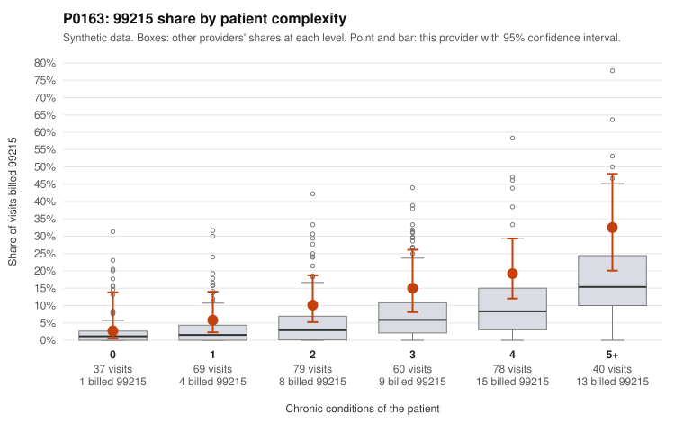

# P0163: P0163 (Family Practice, GA): 99215 share above expectation, but all 18 documented 99215 claims are supported. Leaning toward a legitimately complex panel, with residual questions.

**Leaning (advisory):** Pattern consistent with a high-acuity panel

## Why

P0163 billed 99215 on 13.8% of 363 claims, against 5.4% expected for its patient mix. Complexity alone does not explain this. The provider's 99215 share runs roughly 1.5-2x the all-provider rate in every stratum with 1+ chronic conditions (for example 15.0% vs 7.7% at 3 conditions and 19.2% vs 10.4% at 4). It matches peers only at 0 conditions (2.7% vs 2.6%). Billing is also concentrated at 99214, with 275 of 363 claims. The documentation review points the other way. Of 18 documented 99215 claims, 0 were unsupported, against a 26.9% all-provider unsupported rate. If this provider's true rate matched peers, finding zero in 18 would be unlikely. Documented 99214 claims were unsupported at 5.4% (5 of 92) vs 8.0% for all providers, which is within the range expected from noisy documentation. The packet's example 99215s show high MDM and 43-46 minutes. These include C0068019 (6 chronic conditions) and C0068083, which was billed on a 1-condition osteoarthritis patient yet documented as high MDM at 45 minutes. Overall the pattern fits a provider with a sicker or more intensively managed panel, or more thorough documentation, rather than upcoding. Caveats: only 33.6% of claims are documented, and the claim lists are random samples. The packet does not show documentation status for the other low-complexity 99215 claims (C0067988, C0068055, C0068182, C0068211). These include a 0-condition rash visit and single-diagnosis hypertension or hyperlipidemia visits.

## Evidence chart

## Cited claims

`C0068019`, `C0068083`, `C0067977`, `C0068047`, `C0067988`, `C0068055`, `C0068182`, `C0068211`, `C0067891`, `C0067995`, `C0068017`, `C0068024`, `C0068163`

## Suggested next steps

- Pull records for the low-complexity 99215 claims not shown as documented (C0067988, C0068055, C0068182, C0068211) and confirm whether high MDM or 40+ minutes is supported.
- Expand the documentation sample for 99215 claims beyond 18 to firm up the 0% unsupported finding, prioritizing patients with 0-2 chronic conditions.
- Review the five unsupported 99214 claims (C0067891, C0067995, C0068017, C0068024, C0068163) for a common pattern such as template use or time rounding, given the heavy 99214 concentration (275 of 363 claims).
- Check whether claims-based chronic condition counts understate true acuity (for example undercoded comorbidities or acute presentations), which could explain the elevated within-stratum 99215 share.
- Consider closing or deprioritizing the case if the expanded documentation review continues to support billed levels.

---
Citations checked: 13/13 valid. Synthetic data. The leaning is advisory; the flag comes from the statistical screen, and no clinical documentation is available beyond the sampled records-review facts shown in the packet.
