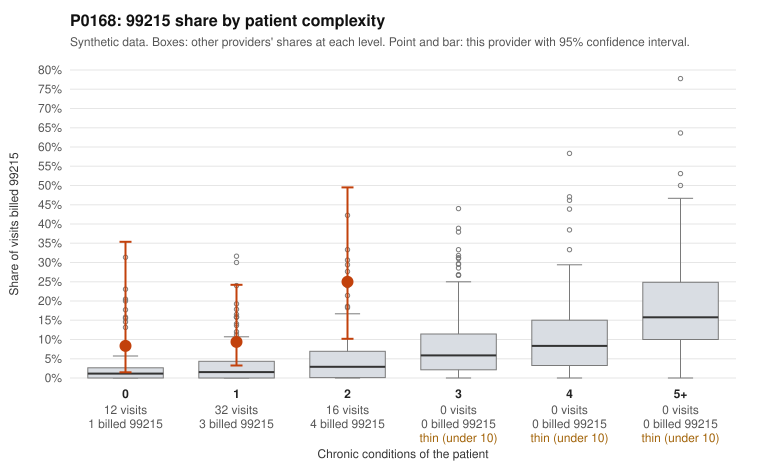

# P0168: P0168 (Family Practice, GA): 99215 share well above what patient complexity predicts, but the few documented 99215s support the billed level, so the review is inconclusive

**Leaning (advisory):** Inconclusive

## Why

P0168 billed 8 of 60 claims (13.3%) as 99215, against an expected 2.0% given patient complexity (risk-adjusted score 2.31; peer z 1.26). The excess shows up in every complexity tier: 8.3% vs 2.6% at 0 conditions, 9.4% vs 3.3% at 1, and 25% vs 4.8% at 2. The packet shows no 99215s on patients with 4 or more conditions. Sampled 99215s on low-complexity patients include one on a 30-year-old with no chronic conditions billed only Z09 follow-up (C0068890), and single-condition visits for hyperlipidemia (C0068853) and hypertension in a 25-year-old (C0068883). Some 99214s also fall on 0-condition Z09 visits (C0068870, C0068874). Taken alone, this complexity comparison is consistent with upcoding. The documentation review does not support that reading, though. Of the 15 claims in the by-level breakdown, none is unsupported: 4 of 99213, 9 of 99214 and 2 of 99215. Both documented 99215s show high MDM, at 43 minutes (C0068856, an osteoarthritis patient) and 54 minutes (C0068873). Only 2 of the 8 99215s have records, so the documentation is too thin to judge whether 99215s are supported. The overall volume is also small (21 patients, 8 total 99215s), which makes the share estimates unstable.

## Evidence chart

## Cited claims

`C0068890`, `C0068853`, `C0068883`, `C0068870`, `C0068874`, `C0068856`, `C0068873`

## Suggested next steps

- Request records for the remaining undocumented 99215 claims, starting with C0068890, C0068853 and C0068883, and check documented MDM level and time against 99215 criteria.
- Pull a larger set of 99214 records on patients with 0-1 chronic conditions (e.g., C0068870, C0068874) to see whether the level inflation pattern extends to 99214.
- Check whether claim diagnosis codes understate patient complexity (e.g., acute problems or conditions missing from the chronic-condition count), which could explain high MDM on apparently simple patients.
- Compare time-based billing: review whether documented minutes routinely meet the 99215 threshold, or whether high MDM is asserted without supporting problem, data or risk elements.
- Re-run the screen with a longer claim window, given the small panel (21 patients) and only 8 total 99215s.

---
Citations checked: 7/7 valid. Synthetic data. The leaning is advisory; the flag comes from the statistical screen, and no clinical documentation is available beyond the sampled records-review facts shown in the packet.
