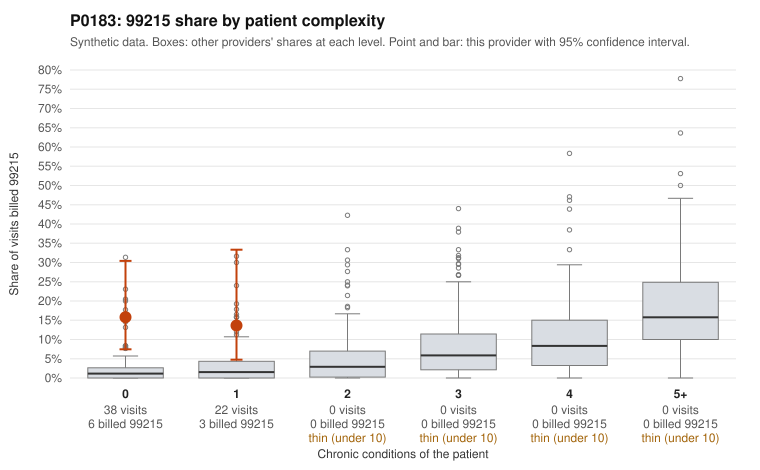

# P0183: P0183 (Family Practice, GA): 15% 99215 share on an all-low-complexity panel, but only 2 of 9 99215 claims documented, both supported; documentation too thin to judge

**Leaning (advisory):** Inconclusive

## Why

All 60 claims are on patients with 0 or 1 chronic conditions, and none of the 99215 claims fall on patients with 4+ conditions. Even so, the provider bills 99215 on 15% of visits, against 1.4% expected for this patient mix. The provider's share is 15.8% versus 2.6% for all providers on 0-condition patients, and 13.6% versus 3.3% on 1-condition patients. All 9 sampled 99215 claims are on low-complexity patients with simple diagnoses. Five are for low back pain (M54.50: C0077595, C0077600, C0077611, C0077613, C0077623), one is for rash (R21: C0077578), and patient P0183-N0013 has two 99215 visits a week apart (C0077578, C0077600). The sampled 99214 claims include upper respiratory infection visits (J06.9: C0077593) and a follow-up exam (Z09: C0077590). The claims data alone therefore fit a pattern consistent with upcoding. The documentation review does not confirm it, however. Only 2 of the 9 99215 claims have records, and both document high MDM at 48-53 minutes (C0077575, C0077595). That gives 0% unsupported versus 26.9% for all providers. At 99213 and 99214, 1 of 8 claims each is unsupported (12.5% versus 7-8%; examples C0077606 and C0077592), which is within what documentation noise could explain at this sample size. With so few documented 99215 claims, the documentation is too thin to judge. The billing-versus-complexity mismatch remains the main concern, but it is not corroborated by records.

## Evidence chart

## Cited claims

`C0077575`, `C0077578`, `C0077595`, `C0077600`, `C0077611`, `C0077613`, `C0077623`, `C0077593`, `C0077590`, `C0077592`, `C0077606`

## Suggested next steps

- Request records for the remaining undocumented 99215 claims, prioritizing the low back pain (M54.50) visits C0077600, C0077611, C0077613, C0077623 and the rash visit C0077578.
- Check whether the documented high-MDM support in C0077575 and C0077595 holds up on reviewer re-scoring. Confirm whether time or MDM was the basis, and whether the problems addressed, data, and risk elements justify high MDM for osteoarthritis and back pain.
- Review the two 99215 visits a week apart for patient P0183-N0013 (C0077578, C0077600) for medical necessity and continuity.
- Expand the documentation sample for 99214 claims on acute minor diagnoses (e.g., J06.9 in C0077593, Z09 in C0077590) to see whether the elevated mix extends below 99215.
- Check whether the patient panel's chronic-condition counts may be under-captured, e.g., missing diagnosis coding, which would understate complexity.

---
Citations checked: 11/11 valid. Synthetic data. The leaning is advisory; the flag comes from the statistical screen, and no clinical documentation is available beyond the sampled records-review facts shown in the packet.
