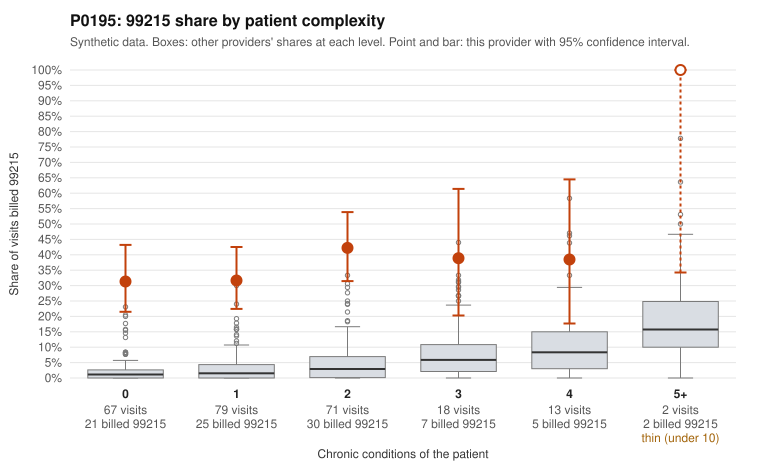

# P0195: P0195 (Family Practice, GA): 36% 99215 share vs ~2.6% expected; 26 of 30 documented 99215 claims (86.7%) unsupported, pattern consistent with upcoding

**Leaning (advisory):** Pattern consistent with upcoding

## Why

P0195 billed 90 of 250 claims (36%) as 99215. The expected share given patient complexity is about 2.6%, and the screen scores are z=4.77 and risk-adjusted 12.66. The elevation is not driven by sicker patients. The 99215 share is 31.3% on patients with 0 chronic conditions and 31.6% on patients with 1, against 2.6% and 3.3% for all providers. In the sample, 99215s were billed for single-issue diagnoses such as UTI (N39.0; C0084079, C0084081, C0084083), low back pain (M54.50; C0084038, C0084139, C0084192), URI (J06.9; C0084196) and follow-up visits (Z09; C0084109, C0084168). The documentation review is reasonably sized at 92 claims (36.8% of claims). Of the 30 documented 99215s, 26 were unsupported (86.7%), versus 26.9% for all providers. 99214 claims were also unsupported at 28.6% versus 8%. Examples include C0083998, billed 99215 for a single-condition CKD patient with documented low MDM and 27 minutes, and C0084090 and C0084116, both documented as moderate MDM. A minority of 99215s were supported with documented high MDM, including C0084154 and C0084190. This fits the expected noise and does not offset the overall pattern. This is a pattern consistent with upcoding, not a finding of fraud.

## Evidence chart

## Cited claims

`C0084079`, `C0084081`, `C0084083`, `C0084038`, `C0084139`, `C0084192`, `C0084196`, `C0084109`, `C0084168`, `C0083998`, `C0084090`, `C0084116`, `C0083971`, `C0084007`, `C0084070`, `C0084154`, `C0084190`

## Suggested next steps

- Pull full records for the remaining 60 undocumented 99215 claims, prioritizing those on patients with 0-1 chronic conditions.
- Have a certified coder independently re-level the 26 unsupported 99215 and 14 unsupported 99214 documented claims to confirm the MDM and time findings.
- Check whether 99215s were billed on time (40+ minutes) and whether the documented minutes and time attestations are credible.
- Look for templated or cloned note language across low-complexity 99215 visits (e.g., UTI, back pain, Z09 follow-ups).
- Estimate the overpayment from the documented-sample unsupported rates by level, and consider a statistically valid extrapolation sample.
- Consider provider education or a prepayment review, and refer for further investigation if the coder review confirms the findings.

---
Citations checked: 17/17 valid. Synthetic data. The leaning is advisory; the flag comes from the statistical screen, and no clinical documentation is available beyond the sampled records-review facts shown in the packet.
