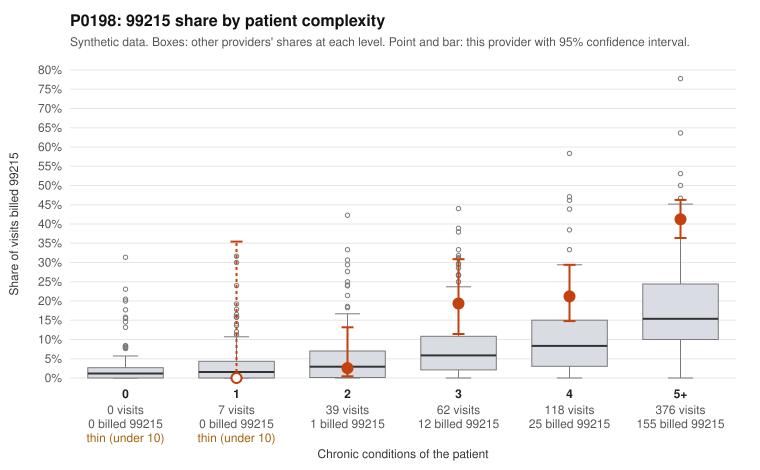

# P0198: P0198 (Family Practice, GA): elevated 99215 share concentrated in a heavily multi-morbid panel, and documentation largely supports billed levels

**Leaning (advisory):** Pattern consistent with a high-acuity panel

## Why

P0198 bills 99215 on 32.1% of 602 claims against 12.9% expected given patient complexity (z=4.16, risk-adjusted score 5.34). However, 376 of 602 visits are for patients with 5+ chronic conditions, and 155 of 193 99215s fall in that group. There are no sampled 99215 claims on 0-1 condition patients, and the 99215 share is low in the 1-2 condition strata (0.0% and 2.6%). The provider's 99215 share does exceed peers within each 3+ stratum (for example 41.2% vs 22.4% at 5+), so some above-norm intensity remains. The records review is reasonably sized (64 documented 99215 claims). It found only 4 unsupported, a 6.2% rate against 26.9% for all providers, which is within the expected noise for honest billing. Examples where documentation supports the level include C0085303 (high MDM, 42 min) and C0085371 (high MDM, 46 min). A few mismatches exist, such as C0085653 (billed 99215, moderate MDM, 35 min) and C0085287 (moderate MDM, 30 min). Some sampled claims also show thin diagnosis coding relative to listed conditions (for example C0085130 coded only I10;Z09). Overall the pattern is consistent with a legitimately complex panel rather than systematic upcoding, though documentation covers only 29.6% of claims.

## Evidence chart

## Cited claims

`C0085303`, `C0085371`, `C0085419`, `C0085430`, `C0085653`, `C0085287`, `C0085531`, `C0085656`, `C0085130`, `C0085101`

## Suggested next steps

- Pull full records for the 4 unsupported 99215 claims (C0085287, C0085531, C0085653, C0085656) to confirm whether MDM or time could justify the level.
- Review 99215 share within the 3- and 4-condition strata (19.4% and 21.2% vs peers at 7.7% and 10.4%) to see whether intensity remains elevated after accounting for complexity.
- Check whether diagnosis coding on claims reflects the conditions actually addressed, since several 99215s list one or two codes (e.g., C0085101 with only E78.5).
- Consider expanding the documentation sample beyond 29.6% if the risk-adjusted flag warrants further assurance; otherwise prioritize lower in the queue.
- Review the few 99214 claims on 1-condition patients (e.g., C0085149, C0085463) and the 99214 mismatches documented as low MDM for any downcoding/upcoding drift at the 99214 level.

---
Citations checked: 10/10 valid. Synthetic data. The leaning is advisory; the flag comes from the statistical screen, and no clinical documentation is available beyond the sampled records-review facts shown in the packet.
