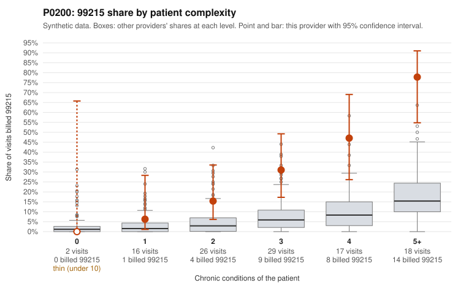

# P0200: P0200 (Family Practice, GA): 99215 share far above peers, but documented 99215 claims mostly support the billed level, consistent with a high-acuity panel

**Leaning (advisory):** Pattern consistent with a high-acuity panel

## Why

P0200 billed 99215 on 33% of 108 claims against a 6.4% expected share given patient complexity (z=4.36, risk-adjusted 4.37), with no 99211/99212. The 99215s cluster on complex patients: 78% of visits for patients with 5+ conditions and 47% at 4 conditions, versus 6% at 1 condition and 0% at 0. Only one sampled 99215 falls on a low-complexity patient (C0088231, obesity only, age 82). Documentation is the deciding evidence. Of 14 documented 99215 claims, only 1 was unsupported (7.1%), well below the all-provider rate of 26.9%. Examples documenting high MDM and 40+ minutes include C0088247 and C0088279, both on 4-7 condition patients. The one unsupported 99215, C0088185, documented moderate MDM at 37 minutes. Documented 99214s were 0/11 unsupported. One caveat remains: the provider's 99215 share exceeds peers within every complexity stratum (for example 31% vs 7.7% at 3 conditions), which chronic-condition counts alone do not explain. Records cover only 26% of claims, and 99213 has just 3 documented claims (1 unsupported, C0088205), too few to judge. Overall the pattern is more consistent with a sicker panel and thorough documentation than with upcoding, though it is not conclusive.

## Evidence chart

## Cited claims

`C0088231`, `C0088247`, `C0088279`, `C0088183`, `C0088188`, `C0088185`, `C0088205`, `C0088174`

## Suggested next steps

- Pull records for the low-complexity 99215 (C0088231) and for the 99214 on a 0-condition Z09 follow-up (C0088174) to check whether the documentation supports those levels.
- Expand documentation sampling, prioritizing 99215s on patients with 1-3 chronic conditions, where the excess over peers is proportionally large.
- Review the unsupported 99215 C0088185 for whether the level was chosen on time rather than MDM (37 minutes documented).
- Compare documentation across visits for the same patient (e.g., P0200-N0027, P0200-N0033, P0200-N0007, each billed both 99214 and 99215) to check whether level selection is consistent with acuity on the day.
- Check for templated or cloned note language, which could inflate documented MDM without true complexity.
- Consider whether practice context (e.g., a geriatric or complex-care focus) explains the within-stratum excess.

---
Citations checked: 8/8 valid. Synthetic data. The leaning is advisory; the flag comes from the statistical screen, and no clinical documentation is available beyond the sampled records-review facts shown in the packet.
