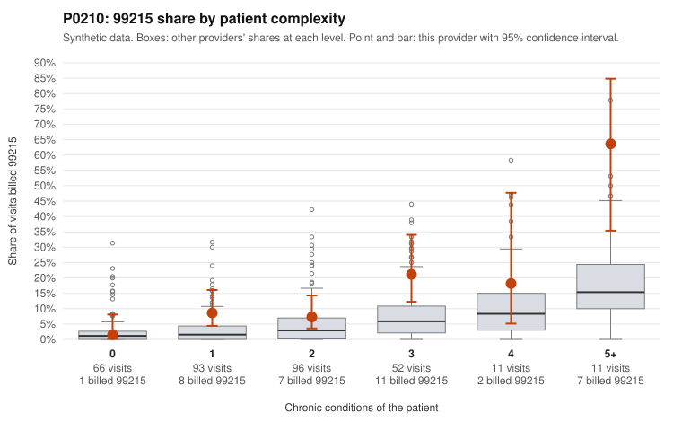

# P0210: P0210 (Family Practice, GA): elevated 99215 share, but all 11 documented 99215 claims are supported. Pattern leans toward a legitimately complex panel, with residual questions on low-complexity visits.

**Leaning (advisory):** Pattern consistent with a high-acuity panel

## Why

P0210 billed 99215 on 10.9% of 329 claims, against 3.2% expected for its patient mix (risk-adjusted score 2.98, peer z 0.89). The excess is concentrated in complex patients: 63.6% of visits for patients with 5+ conditions were 99215, versus 22.4% across all providers, and 21.2% versus 7.7% at 3 conditions. Examples include C0091890, C0091891 and C0091929. The records review is the strongest evidence. None of the 11 documented 99215 claims were unsupported, against a 26.9% unsupported rate across all providers. Examples with high MDM and 40+ minutes include C0091729, C0091787 and C0091891. This is consistent with a legitimately complex panel rather than upcoding. Two concerns remain. First, the 99215 share for 1-condition patients is 8.6% versus 3.3% for all providers, with sampled examples on single-diagnosis visits such as C0091811 (obesity) and C0091820 (rash, no chronic conditions). Second, 99213 claims show a 13.5% unsupported rate versus 7.1% for all providers, but that is only 5 of 37 and within plausible documentation noise. Only 29.5% of claims have records, 11 documented 99215 claims is a modest sample, and the packet does not show whether any of the low-complexity 99215 claims were documented.

## Evidence chart

## Cited claims

`C0091890`, `C0091891`, `C0091929`, `C0091729`, `C0091787`, `C0091811`, `C0091820`

## Suggested next steps

- Pull records for the sampled low-complexity 99215 claims (C0091691, C0091694, C0091747, C0091805, C0091811, C0091820, C0091839, C0091947, C0091958) and confirm MDM level and time.
- Check whether any of the 11 documented 99215 claims fall in the 0-1 chronic condition group; if none do, the clean documentation result may not cover the area of concern.
- Expand documentation sampling of 99215 claims beyond 11 to firm up the 0% unsupported finding.
- Review the 99213 unsupported examples (C0091732, C0091853, C0091959, C0091993, C0092007), along with 99214 examples C0091834 and C0091856, for a consistent one-level overcoding habit at lower levels.
- If the low-complexity 99215 records hold up, consider closing with routine monitoring; if they do not, consider a targeted probe audit.

---
Citations checked: 7/7 valid. Synthetic data. The leaning is advisory; the flag comes from the statistical screen, and no clinical documentation is available beyond the sampled records-review facts shown in the packet.
