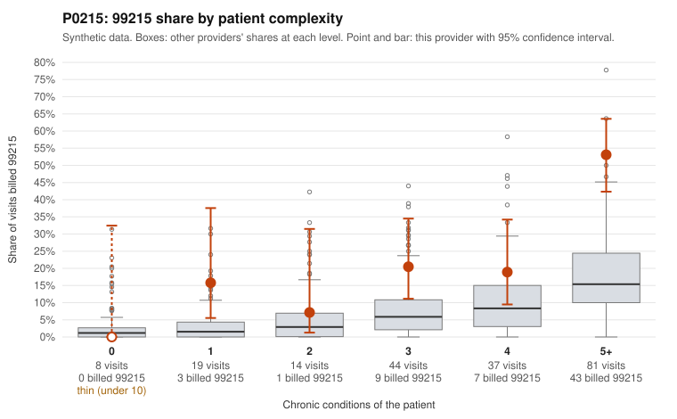

# P0215: P0215: high 99215 share (31% vs 9.6% expected) largely supported by documentation and concentrated in multimorbid patients, but 99214 documentation gaps warrant follow-up

**Leaning (advisory):** Pattern consistent with a high-acuity panel

## Why

P0215 billed 63 of 203 claims as 99215 (31%), against an expected 9.6% given patient complexity (z=4.0, risk-adjusted score 3.95). However, 43 of the 63 99215s fall on patients with 5+ chronic conditions. Records review is the strongest evidence. Of 17 documented 99215 claims, only 1 was unsupported (5.9%), well below the all-provider rate of 26.9%. Supported examples include C0092920 (4 conditions, high MDM, 40 min) and C0093003, which is a low-complexity patient documented at high MDM with 47 min. The single unsupported 99215 is C0092887 (moderate MDM, 33 min). This 99215 pattern is consistent with a legitimately complex panel, although the provider's 99215 share still exceeds peers within every stratum that has 1 or more conditions. The weaker spot is 99214. Of 38 documented 99214 claims, 6 were unsupported (15.8%, about double the 8.0% all-provider rate), each documented at low MDM with 21-28 min (e.g., C0092828, C0092942). The billing also contains no 99211 or 99212 claims at all, and the sample includes a 99214 on a patient with 0 chronic conditions (C0092823). Documentation covers only 27.6% of claims, so these findings are not conclusive.

## Evidence chart

## Cited claims

`C0092920`, `C0093003`, `C0092887`, `C0092828`, `C0092867`, `C0092913`, `C0092931`, `C0092942`, `C0092962`, `C0092823`, `C0092855`, `C0092999`

## Suggested next steps

- Pull documentation for the two undocumented low-complexity 99215 claims, C0092855 (hypertension only) and C0092999 (atrial fibrillation only), to confirm high MDM or time of 40+ minutes.
- Expand the records sample for 99214 claims, focusing on patients with 0-2 chronic conditions, to test whether the elevated 15.8% unsupported rate holds.
- Review the 6 unsupported 99214 claims (C0092828, C0092867, C0092913, C0092931, C0092942, C0092962) for a common pattern, such as templated notes or visit type.
- Assess why there are no 99211 or 99212 claims, and whether low-acuity visits like C0092823 (UTI, 0 conditions) are routinely billed at 99214.
- Request additional 99215 documentation to firm up the 17-claim sample, and confirm whether 99215 billing is based on MDM or on total time.

---
Citations checked: 12/12 valid. Synthetic data. The leaning is advisory; the flag comes from the statistical screen, and no clinical documentation is available beyond the sampled records-review facts shown in the packet.
