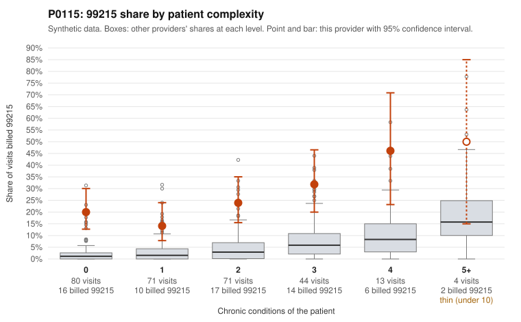

# Payment Integrity dossier: P0115

> Draft for human review. Statistical and records-sample evidence only; not a finding. Compliance or legal review is needed before any provider contact, notice or recoupment.

## Provider overview

| | |
|---|---|
| Specialty / state | Family Practice, GA (synthetic) |
| Claims / patients | 283 / 112 |
| Billed mix (99211 to 99215) | 2 / 0 / 51 / 165 / 65 |
| 99215 share | 23.0% |
| Expected 99215 share given patient complexity | 2.9% |
| Screen scores | z vs peers 2.75; risk-adjusted 7.68; flagged by zscore+riskadj |

## Case summary (advisory)

**P0115 (Family Practice, GA): 99215 share ~23% vs ~2.9% expected for its patient mix; 8 of 10 documented 99215s unsupported, a pattern consistent with upcoding**

Leaning: pattern consistent with upcoding. Citations checked: 15/15 valid.

P0115 billed 65 of 283 claims as 99215 (share 0.23), against an expected 0.029 given patient complexity (z 2.75 vs peers, risk-adjusted score 7.68). The excess is not explained by a sicker panel. Low-complexity patients drive much of it: 26 of 151 visits with 0-1 chronic conditions were billed 99215 (20% and 14.1%, vs 2.6% and 3.3% for all providers). Sampled examples include routine problems with no chronic conditions, such as UTI (C0046021, C0046028, C0046139), URI (C0046055, C0046238), and rash (C0046031, C0046177, C0046206). The provider also bills 99215 at roughly 2-4x peer rates in every complexity band, including the 4+ condition band. Documentation points the same way. 8 of 10 documented 99215 claims did not support the billed level (80% vs 26.9% all-provider). Examples include C0045989, C0046062, C0046082 and C0046100, each documented as moderate MDM at about 31-35 minutes. The 99214s also look inflated: 12 of 43 documented 99214s were unsupported (27.9% vs 8%), e.g. C0046162, an osteoarthritis visit documented as low MDM at 23 minutes. Only 2 documented 99215s were supported (C0046002, and C0046155 on a 5-condition patient). Caveats: only 10 documented 99215s exist and records cover 22% of claims, so these rates are directional rather than definitive. This is a pattern consistent with upcoding, not a finding of fraud.

## Evidence chart

## Records-review sample so far

Documentation is on file for 63 claims (22% of this provider's claims).

| Billed | Documented | Documentation below billed level | Rate | All-provider rate |
|---|---|---|---|---|
| 99213 | 9 | 0 | 0.0% | 7.1% |
| 99214 | 43 | 12 | 27.9% | 8.0% |
| 99215 | 10 | 8 | 80.0% | 26.9% |

## Recommended next steps for Payment Integrity

1. Request records for the sampled claims in `record_request_list.csv` (34 claims across 99215).
2. Review the records against E/M documentation rules and record the supported level for each claim.
3. Run the overpayment estimator on the reviewed sample (`sampling_plan.md` explains how).
4. Notice, appeal rights, recoupment, education or corrective action, and any referral are decisions for the PI team, compliance and counsel. Nothing here drafts those.

Suggested follow-ups from the case summary:

- Request full medical records for a larger sample of 99215 claims, prioritizing those on 0-1 condition patients (e.g., C0046021, C0046055, C0046177), to firm up the 80% unsupported rate drawn from only 10 documented claims.
- Extend documentation review to more 99214 claims, given the 27.9% unsupported rate vs the 8% peer rate.
- For unsupported claims, check whether time-based billing (minutes) or other documented elements could justify the level, and whether documentation is templated or cloned across visits.
- Review repeat-patient patterns where low-complexity patients received multiple 99215s (e.g., P0115-N0088, P0115-N0030, P0115-N0017).
- Check whether coding is done by the provider or by billing staff or software defaults, and consider provider education or prepayment review pending the expanded audit.

## Limits

- Synthetic data; no real claims or providers.
- The leaning is advisory. The flag comes from the statistical screen; the summary explains it.
- The records-review sample is partial and was simulated for this project.
- Allowed amounts are GA Family Practice averages from a public CMS file, not this provider's actual payments.
