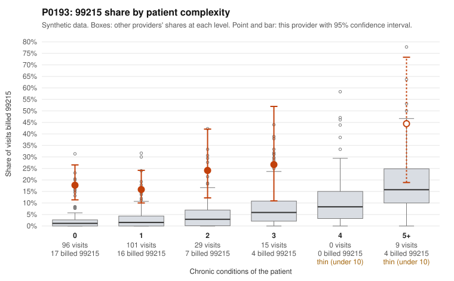

# Payment Integrity dossier: P0193

> Draft for human review. Statistical and records-sample evidence only; not a finding. Compliance or legal review is needed before any provider contact, notice or recoupment.

## Provider overview

| | |
|---|---|
| Specialty / state | Family Practice, GA (synthetic) |
| Claims / patients | 250 / 101 |
| Billed mix (99211 to 99215) | 3 / 2 / 56 / 141 / 48 |
| 99215 share | 19.2% |
| Expected 99215 share given patient complexity | 2.3% |
| Screen scores | z vs peers 2.17; risk-adjusted 6.78; flagged by zscore+riskadj |

## Case summary (advisory)

**P0193 (Family Practice, GA): 99215 billing far above complexity-expected levels, and most documented 99215s are not supported by the records. The pattern is consistent with upcoding.**

Leaning: pattern consistent with upcoding. Citations checked: 13/13 valid.

P0193 billed 99215 on 19.2% of 250 claims, against about 2.3% expected for this panel's complexity (z = 2.17, risk-adjusted score 6.78). The excess is not driven by sick patients. The 99215 share is 17.7% for patients with 0 chronic conditions (peers 2.6%) and 15.8% for patients with 1 condition (peers 3.3%), and those two groups make up 197 of 250 visits. Sampled examples include 99215s for a rash (R21; C0083702, C0083727), a follow-up visit (Z09; C0083645) and an upper respiratory infection (J06.9; C0083741). In the records review, 12 of 16 documented 99215 claims (75%) did not support the billed level, versus 26.9% across all providers. Examples documented only moderate MDM: C0083692 (30 min), C0083841 (32 min) and C0083670 (39 min, on a 5-condition patient). Billed 99214s, which make up most of the volume, were unsupported 25% of the time (9 of 36) versus 8% across providers (e.g., C0083616, C0083728). Some 99215s are legitimately supported, mostly on complex patients (C0083651, C0083658 with high MDM). Caveats: only 25.2% of claims have documentation, n = 16 documented 99215s is small, and documentation review is itself noisy. Even so, an unsupported rate nearly three times the peer rate, together with the complexity mismatch, points toward upcoding rather than a high-acuity panel.

## Evidence chart

## Records-review sample so far

Documentation is on file for 63 claims (25% of this provider's claims).

| Billed | Documented | Documentation below billed level | Rate | All-provider rate |
|---|---|---|---|---|
| 99213 | 11 | 1 | 9.1% | 7.1% |
| 99214 | 36 | 9 | 25.0% | 8.0% |
| 99215 | 16 | 12 | 75.0% | 26.9% |

## Recommended next steps for Payment Integrity

1. Request records for the sampled claims in `record_request_list.csv` (29 claims across 99215).
2. Review the records against E/M documentation rules and record the supported level for each claim.
3. Run the overpayment estimator on the reviewed sample (`sampling_plan.md` explains how).
4. Notice, appeal rights, recoupment, education or corrective action, and any referral are decisions for the PI team, compliance and counsel. Nothing here drafts those.

Suggested follow-ups from the case summary:

- Request full medical records for all 48 billed 99215 claims and a larger sample of the 141 billed 99214 claims, prioritizing 0–1 condition patients.
- Have a certified coder independently re-level the documented claims using 2021+ MDM/time criteria, and check whether time statements support 99215 (40+ minutes).
- Check for templated or cloned notes across low-complexity 99215 visits (e.g., the repeated R21 and Z09 encounters).
- Compare diagnosis coding completeness against prior-year claims and pharmacy data, to rule out undercaptured patient complexity.
- Estimate the overpayment from the re-leveled sample and consider provider education or a prepayment review depending on the findings.

## Limits

- Synthetic data; no real claims or providers.
- The leaning is advisory. The flag comes from the statistical screen; the summary explains it.
- The records-review sample is partial and was simulated for this project.
- Allowed amounts are GA Family Practice averages from a public CMS file, not this provider's actual payments.
