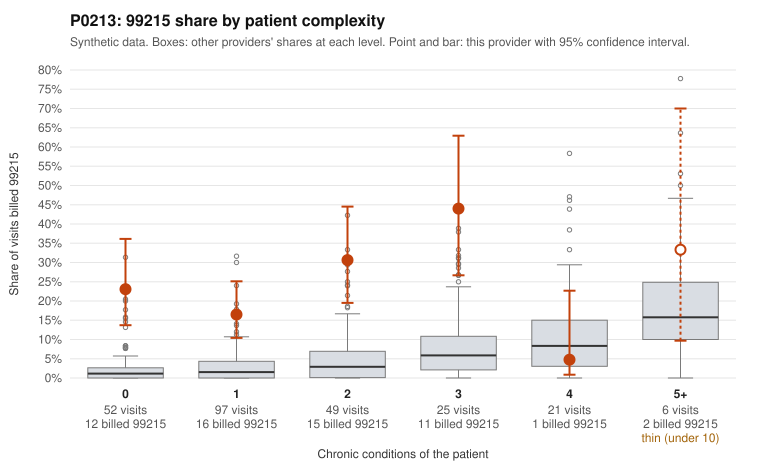

# Payment Integrity dossier: P0213

> Draft for human review. Statistical and records-sample evidence only; not a finding. Compliance or legal review is needed before any provider contact, notice or recoupment.

## Provider overview

| | |
|---|---|
| Specialty / state | Family Practice, GA (synthetic) |
| Claims / patients | 250 / 97 |
| Billed mix (99211 to 99215) | 2 / 3 / 57 / 131 / 57 |
| 99215 share | 22.8% |
| Expected 99215 share given patient complexity | 3.0% |
| Screen scores | z vs peers 2.73; risk-adjusted 6.94; flagged by zscore+riskadj |

## Case summary (advisory)

**P0213 (Family Practice, GA): 99215 billing far above complexity expectations, and 14 of 19 documented 99215 claims (73.7%) are unsupported by the records: pattern consistent with upcoding**

Leaning: pattern consistent with upcoding. Citations checked: 12/12 valid.

P0213 billed 99215 on 22.8% of 250 claims, against about 3.0% expected for this patient mix (z vs peers 2.73, risk-adjusted score 6.94). The excess is concentrated in low-complexity patients. The 99215 share is 23.1% for patients with 0 chronic conditions (all-provider rate 2.6%) and 16.5% for patients with 1 condition (3.3%). By contrast, it is only 4.8% for patients with 4 conditions (10.4%). Sampled 99215s on 0-condition patients carry routine diagnoses such as rash, back pain, URI, UTI and follow-up (e.g., C0092350, C0092392, C0092448, C0092550, C0092577). The strongest evidence is documentation review. Of 19 documented 99215 claims, 14 (73.7%) do not support the billed level, versus 26.9% across all providers. Examples documented at moderate MDM with 36-38 minutes include C0092497 (0-condition patient, URI), C0092508 (0-condition patient, rash) and C0092548. Some 99215s are supported, e.g., C0092472 (6-condition patient) and C0092399 and C0092585 (both 0-condition patients, high MDM). This shows some low-complexity visits can legitimately reach 99215. Unsupported rates for 99214 (13.5% vs 8.0%) and 99213 (15.4% vs 7.1%) are also modestly elevated; for example, C0092467 was billed 99214 with low MDM. Records cover only 72 claims (28.8%), and documentation is noisy. Even so, the 99215 gap is large. This is a pattern consistent with upcoding, not a finding of fraud.

## Evidence chart

## Records-review sample so far

Documentation is on file for 72 claims (29% of this provider's claims).

| Billed | Documented | Documentation below billed level | Rate | All-provider rate |
|---|---|---|---|---|
| 99213 | 13 | 2 | 15.4% | 7.1% |
| 99214 | 37 | 5 | 13.5% | 8.0% |
| 99215 | 19 | 14 | 73.7% | 26.9% |

## Recommended next steps for Payment Integrity

1. Request records for the sampled claims in `record_request_list.csv` (32 claims across 99215).
2. Review the records against E/M documentation rules and record the supported level for each claim.
3. Run the overpayment estimator on the reviewed sample (`sampling_plan.md` explains how).
4. Notice, appeal rights, recoupment, education or corrective action, and any referral are decisions for the PI team, compliance and counsel. Nothing here drafts those.

Suggested follow-ups from the case summary:

- Pull full records for the remaining undocumented 99215 claims, prioritizing those on 0-1 condition patients (e.g., C0092360, C0092392, C0092448, C0092577, C0092581), to see whether the 73.7% unsupported rate holds.
- Have a certified coder re-audit the 14 unsupported 99215s, confirming MDM elements and checking whether total time could independently justify 99215 under current time thresholds.
- Review the supported 99215s on low-complexity patients (C0092399, C0092585) to understand what drove high MDM, and whether that rationale recurs or is templated.
- Assess 99214 billing on 0-condition patients (e.g., C0092467, C0092516) given the elevated 99214 unsupported rate.
- Check for cloned or templated notes, and compare billing level against payer, visit type and scheduling slot length.
- Consider a probe sample with extrapolation, and provider education or prepayment review, pending audit results.

## Limits

- Synthetic data; no real claims or providers.
- The leaning is advisory. The flag comes from the statistical screen; the summary explains it.
- The records-review sample is partial and was simulated for this project.
- Allowed amounts are GA Family Practice averages from a public CMS file, not this provider's actual payments.
