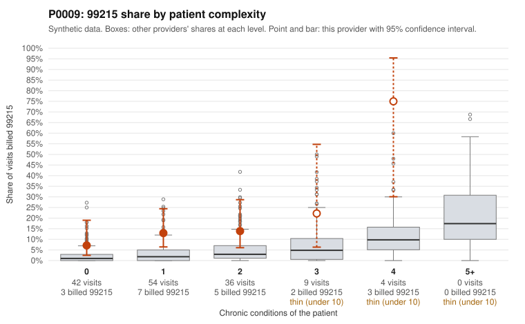

# P0009: P0009 (Family Practice, GA): 99215 share well above expected even on low-complexity patients, but the limited documentation reviewed supports the billed levels. Inconclusive pending a larger records pull.

**Leaning (advisory):** Inconclusive

## Why

P0009 billed 99215 on 13.8% of 145 claims, against an expected 2.5% given patient complexity (risk-adjusted score 3.19). The billing mix is also concentrated at 99214 (92 of 145). The excess appears in every complexity stratum, including patients with 0 chronic conditions (7.1% vs 2.1% for all providers) and 1 condition (13.0% vs 3.4%). So by chronic-condition count this panel does not look unusually sick. Sampled low-complexity 99215 claims carry single, often minor diagnoses, for example R21 rash (C0003267) and I10 in an 18-year-old (C0003216). However, the documentation review points the other way. All 5 documented 99215 claims supported the billed level (0% unsupported vs 24.2% for all providers), and so did all 20 documented 99214 claims (0% vs 8.4%). Three of the supported 99215s are on low-complexity patients, with high MDM documented at 40 to 49 minutes (C0003234, C0003259, C0003327). Five documented 99215 claims is too thin to judge: even at the all-provider rate, seeing zero unsupported out of 5 would not be unusual. The pattern therefore neither confirms upcoding nor clearly reflects a high-acuity panel. Chronic-condition counts may also miss acute complexity that the records capture.

## Evidence chart

## Cited claims

`C0003267`, `C0003216`, `C0003217`, `C0003213`, `C0003234`, `C0003259`, `C0003327`, `C0003219`, `C0003204`, `C0003210`, `C0003330`, `C0003274`

## Suggested next steps

- Request records for additional 99215 claims, prioritizing the low-complexity ones not yet reviewed (e.g., C0003213, C0003216, C0003217, C0003235, C0003267, C0003305, C0003325), to get a documented 99215 sample large enough to compare against the 24.2% all-provider unsupported rate.
- Check whether the documented high MDM on low-complexity visits (C0003234, C0003259, C0003327) reflects genuine acute problems, workup or risk, or template-driven or cloned note content.
- Review repeat 99215s on the same patient with no chronic conditions (P0009-N0049: C0003327 and C0003267, both R21), plus the 99214 for that patient (C0003239, Z09 follow-up), for clinical justification.
- Audit a sample of 99214 claims on 0-1 condition patients, since 99214 dominates the mix and the shift may extend beyond 99215.
- Confirm whether time-based billing is being used, and whether documented minutes reflect total time on the date of service.

---
Citations checked: 12/12 valid. Synthetic data. The leaning is advisory; the flag comes from the statistical screen, and no clinical documentation is available beyond the sampled records-review facts shown in the packet.
