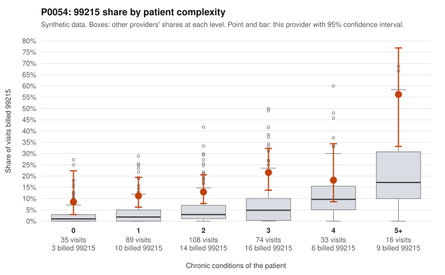

# P0054: P0054 (Family Practice, GA): 99215 share about 4x risk-adjusted expectation, but sampled documentation largely supports billed levels. Leans toward a legitimately complex panel, with caveats.

**Leaning (advisory):** Pattern consistent with a high-acuity panel

## Why

P0054 billed 58 of 355 claims as 99215 (16.3%), against an expected 4.2% given patient complexity (risk-adjusted score 4.16, z vs peers 1.66). The excess shows up in every complexity tier, including patients with 0 chronic conditions (8.6% vs 2.1% all-provider) and 1 condition (11.2% vs 3.4%). The sample includes 99215s on single-condition patients such as hyperlipidemia (C0023651, C0023704, C0023769) and on patients with no chronic conditions (C0023884, C0023893, C0023958). That billing pattern alone would raise concern. The records review points the other way. Of 16 documented 99215 claims, 2 were unsupported (12.5%), about half the all-provider rate of 24.2%. Documented 99214 claims (1 of 67 unsupported, 1.5% vs 8.4%) and 99213 claims (0 of 17 vs 7.5%) also compare favorably. One low-complexity 99215, C0023971 (COPD patient), was documented at high MDM with 50 minutes, which suggests chronic-condition counts may understate acute visit complexity. Another, C0023908 (asthma), was documented at moderate MDM with 31 minutes and is unsupported, as is C0023653. With only 16 documented 99215s (about 28% of all claims documented), this evidence is suggestive rather than conclusive. Overall, the pattern is more consistent with a sicker or more acute panel than with systematic upcoding.

## Evidence chart

## Cited claims

`C0023651`, `C0023704`, `C0023769`, `C0023884`, `C0023893`, `C0023958`, `C0023971`, `C0023908`, `C0023653`, `C0023666`, `C0023724`, `C0023780`

## Suggested next steps

- Expand the records review to more 99215 claims on patients with 0-1 chronic conditions (for example C0023884, C0023893, C0023958, C0023651), since this is the tier with the largest excess over peers.
- Review the unsupported 99215 claims C0023908 and C0023653 to see whether the gap reflects documentation quality or level selection.
- Check whether acute diagnoses on low-complexity visits (for example M54.50, R10.9, N39.0) were documented with high-risk MDM elements such as workup or escalation, rather than relying only on chronic-condition counts.
- Compare the 99214 share (220 of 355, about 62%) with Family Practice peers in GA; that baseline is not in the packet.
- Check whether time-based billing is driving 99215 selection by looking at the distribution of documented minutes on 99215 claims.

---
Citations checked: 12/12 valid. Synthetic data. The leaning is advisory; the flag comes from the statistical screen, and no clinical documentation is available beyond the sampled records-review facts shown in the packet.
