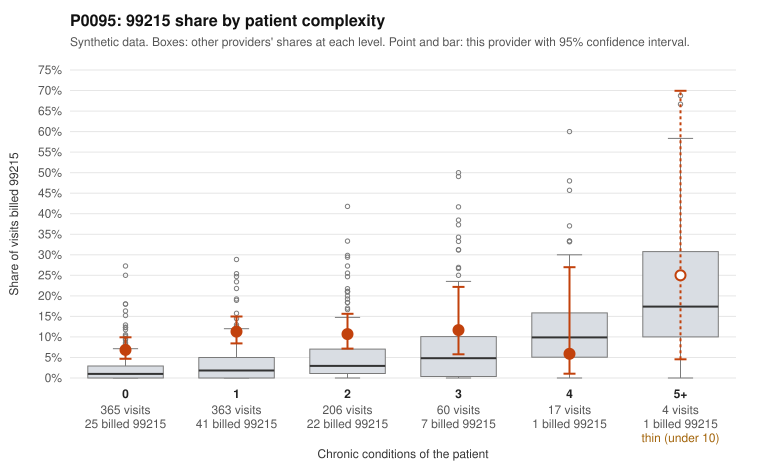

# P0095: P0095 (Family Practice, GA): 99215 share well above complexity-adjusted expectation, and 25 of 27 documented 99215 claims are unsupported; pattern consistent with upcoding

**Leaning (advisory):** Pattern consistent with upcoding

## Why

P0095 billed 99215 on 9.6% of 1,015 claims versus an expected 2.3% given patient complexity (risk-adjusted score 5.51), although the raw peer z-score is only 0.62. The excess is concentrated in the simplest patients. 99215 share is 6.8% at 0 chronic conditions (peers 2.1%) and 11.3% at 1 condition (peers 3.4%). At 4+ conditions the provider is at or below peers. The sampled low-complexity 99215s include routine-looking diagnoses such as URI (C0048602, C0048948), low back pain (C0048625, C0049007) and rash (C0048730). Documentation is the strongest signal. 25 of 27 documented 99215 claims (92.6%) do not support the billed level, against 24.2% across all providers; examples are C0048719 and C0049258, both documented as moderate MDM at about 35 minutes. The 99214 unsupported rate is also elevated (22.1% vs 8.4%). Only a few 99215s are documented as supported (e.g., C0048506, high MDM, 46 minutes). Caveats: 27 documented 99215s is a modest sample, records cover about 30% of claims, documentation is noisy, and the claim lists are random samples. This is a pattern consistent with upcoding, not a finding of fraud.

## Evidence chart

## Cited claims

`C0048602`, `C0048948`, `C0048625`, `C0049007`, `C0048730`, `C0048719`, `C0049258`, `C0048506`

## Suggested next steps

- Pull full records for the 25 unsupported 99215 claims and confirm MDM level and time against 2021+ E/M guidelines.
- Expand documentation review to more undocumented 99215 claims, prioritizing 0-1 chronic-condition patients, to firm up the 92.6% rate.
- Review the 99214 claims with low documented MDM (e.g., C0049073, C0049119) to assess whether level inflation extends beyond 99215.
- Check whether time-based billing, prolonged services, or same-day procedures could explain any high-level codes.
- Compare this provider's E/M mix over time and against same-practice colleagues for template or EHR-default effects.

---
Citations checked: 8/8 valid. Synthetic data. The leaning is advisory; the flag comes from the statistical screen, and no clinical documentation is available beyond the sampled records-review facts shown in the packet.
