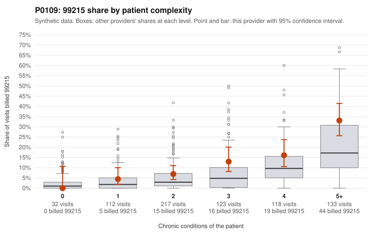

# P0109: P0109 (Family Practice, GA): elevated 99215 share is largely concentrated in complex patients, and sampled documentation supports 99215s at about the all-provider rate. Pattern is more consistent with a sicker panel than with upcoding, with caveats.

**Leaning (advisory):** Pattern consistent with a high-acuity panel

## Why

P0109 billed 99215 on 13.5% of 735 claims, against a packet-stated expected share of 7.1% given patient complexity (risk-adjusted score 2.55; peer z 1.22). By stratum, however, the provider's 99215 share is only modestly above the all-provider rate at each complexity level: 0.0% vs 2.1% at 0 conditions, 4.5% vs 3.4% at 1, and 33.1% vs 29.8% at 5+. Of the 99 99215s, 63 fall on patients with 4 or more chronic conditions and only 5 on patients with 0-1 conditions. Applying the stratum all-provider rates to this panel implies about 83 99215s, or roughly 11.3%. That does not match the packet's 7.1% expected share and should be reconciled. Documentation was reviewed for 23 of the 99215 claims. Of these, 5 were unsupported (21.7%), slightly below the all-provider rate of 24.2%. Two of the unsupported claims were documented at moderate MDM: C0054316 (1-condition diabetes patient) and C0054759 (4-condition patient). Supported examples include C0054205, C0054796, C0054844 and C0054878 (high MDM, 40-53 minutes). The 99214 unsupported rate (4.2% vs 8.4%) is also not elevated. Among the low-complexity 99215s, some may be clinically plausible, such as C0054682 (84-year-old with heart failure). Others coded only E78.5 or E66.9 (C0054243, C0054490, C0054257) merit chart review. Overall the evidence is consistent with a legitimately complex panel, not established either way. The documentation sample covers 23 of 99 99215s, and the claim lists are random samples.

## Evidence chart

## Cited claims

`C0054316`, `C0054759`, `C0054205`, `C0054796`, `C0054844`, `C0054878`, `C0054682`, `C0054243`, `C0054490`, `C0054257`

## Suggested next steps

- Reconcile the packet's expected 99215 share (7.1%) with the stratum-weighted all-provider expectation (~11.3%) before relying on the risk-adjusted score.
- Pull charts for the remaining low-complexity 99215s (e.g., C0054243, C0054257, C0054490), focusing on whether acute problems or undocumented comorbidities justify high MDM.
- Expand the documentation review beyond 23 documented 99215s to narrow uncertainty around the 21.7% unsupported rate.
- Compare the provider's 99214 share (511/735, ~70%) with Family Practice peers; the packet gives no peer benchmark for 99214.
- Check whether problem lists match billed diagnosis codes. Several high-complexity claims list few diagnosis codes (e.g., C0054472 billed I10 only), which may indicate complexity is drawn from history rather than addressed at the visit.

---
Citations checked: 10/10 valid. Synthetic data. The leaning is advisory; the flag comes from the statistical screen, and no clinical documentation is available beyond the sampled records-review facts shown in the packet.
