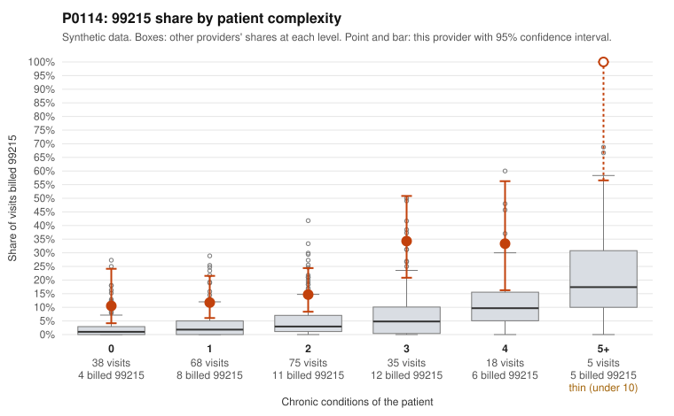

# P0114: P0114: high 99215 share across all complexity levels, but documented 99215s largely support the billed level

**Leaning (advisory):** Pattern consistent with a high-acuity panel

## Why

P0114 billed 99215 on 19.2% of 239 claims, against 3.7% expected from patient complexity (risk-adjusted score 4.72). That excess appears in every complexity stratum, including 0-condition patients (10.5% vs 2.1% for all providers) and 1-condition patients (11.8% vs 3.4%). Sampled low-complexity 99215s include visits coded only J06.9 or R10.9 (C0055395, C0055533, C0055400, C0055495). However, the records review cuts the other way. Only 1 of 16 documented 99215 claims (6.2%) was unsupported, well below the 24.2% all-provider rate, and that one (C0055570) was documented at moderate MDM. Some low-complexity 99215s were documented at high MDM with 47-52 minutes (C0055466, C0055591), as were others (C0055536, C0055594). The 99214 unsupported rate (10.6% vs 8.4%) is only slightly elevated, and 99213 had none. Overall, the pattern is more consistent with visits that are acute or complex beyond what chronic-condition counts capture than with upcoding. Two caveats limit this: only 16 of 46 99215s are documented, and none of the J06.9-only 99215s in the sample have records.

## Evidence chart

## Cited claims

`C0055395`, `C0055533`, `C0055400`, `C0055495`, `C0055570`, `C0055466`, `C0055591`, `C0055536`, `C0055594`, `C0055426`, `C0055590`

## Suggested next steps

- Pull records for the undocumented low-complexity 99215s, prioritizing the J06.9/R10.9-only visits (C0055395, C0055533, C0055400, C0055495), to test whether high MDM holds where diagnoses look minor.
- Increase the documentation sample for 99215 beyond 16 claims to confirm the low unsupported rate is stable.
- Check whether the documentation shows template or cloned language, or time entries that inflate minutes uniformly, since this could make records appear supportive.
- Review the 99214 claims documented at low MDM (C0055406, C0055410, C0055508, C0055544, C0055588) for any recurring pattern.
- Review practice context (e.g., urgent-care-style or post-discharge visits) that could explain high acuity among patients with few chronic conditions.

---
Citations checked: 11/11 valid. Synthetic data. The leaning is advisory; the flag comes from the statistical screen, and no clinical documentation is available beyond the sampled records-review facts shown in the packet.
